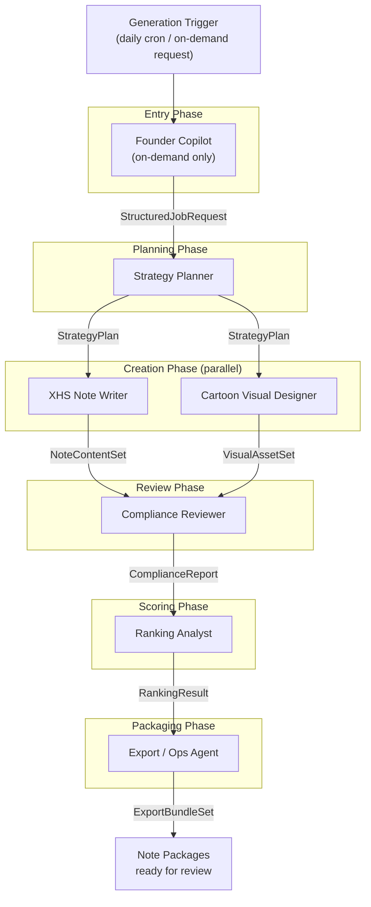
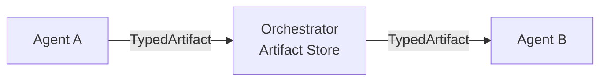

# GenPos — Agent Team Specification

> **Version:** 0.1.0-draft
> **Last updated:** 2026-03-12
> **Status:** Living document — evolves with the system
> **Parent:** [ARCHITECTURE.md](./ARCHITECTURE.md) § 8 (Agent Runtime Architecture)

---

## Table of Contents

1. [Design Goal](#1-design-goal)
2. [Architecture Rule](#2-architecture-rule)
3. [Agent Roles](#3-agent-roles)
4. [Agent Team Schema](#4-agent-team-schema)
5. [Persona Definition Schema](#5-persona-definition-schema)
6. [Orchestration Pipeline](#6-orchestration-pipeline)
7. [Inter-Agent Communication](#7-inter-agent-communication)
8. [Persona Influence Rules](#8-persona-influence-rules)
9. [Team Composition Rules](#9-team-composition-rules)
10. [UI for Agent-Team Composition](#10-ui-for-agent-team-composition)
11. [Team Presets](#11-team-presets-future)
12. [Agent Input/Output Contracts](#12-agent-inputoutput-contracts)

---

## 1. Design Goal

The system allows composing an AI team where:

- **Each agent has a role** — a fixed operational responsibility that defines what the agent does, what tools it accesses, what schemas it consumes and produces, and where it sits in the pipeline.
- **Each agent may have a persona** — a configurable behavioral profile that shapes how the agent writes, critiques, explains, and collaborates.
- **Persona slots are configurable by the owner** — merchants and operators swap, version, and A/B test personas without code changes.
- **Role contracts stay stable even if persona changes** — a persona swap never alters the input/output schema, compliance logic, or orchestration position of any role.

This separation is foundational. Personas change tone, vocabulary, risk appetite, and stylistic preferences. They must never break the production responsibilities of the agent they are attached to.

---

## 2. Architecture Rule

Every agent in the system is composed of two orthogonal layers:

```
┌─────────────────────────────────────────────┐
│              Agent Instance                  │
│                                              │
│  ┌─────────────────────────────────────┐     │
│  │  Role Layer (platform-owned)        │     │
│  │  ─ input schema                     │     │
│  │  ─ output schema                    │     │
│  │  ─ tool access                      │     │
│  │  ─ pipeline position                │     │
│  │  ─ retry policy                     │     │
│  └─────────────────────────────────────┘     │
│                                              │
│  ┌─────────────────────────────────────┐     │
│  │  Persona Layer (merchant-owned)     │     │
│  │  ─ system prompt overlay            │     │
│  │  ─ tone rules                       │     │
│  │  ─ behavioral parameters            │     │
│  │  ─ hard constraints                 │     │
│  │  ─ cultural context                 │     │
│  └─────────────────────────────────────┘     │
│                                              │
└─────────────────────────────────────────────┘
```

| Layer | Owner | Mutability | Storage |
|---|---|---|---|
| **Role** — what the agent does | Platform engineering | Code artifact; changes require review + deploy | `packages/agent-sdk/roles/` |
| **Persona** — how the agent behaves | Merchant / operator | Data artifact; changes via UI, no deploy needed | `services/persona-service` (database) |

Roles are **code**. Personas are **data**.

---

## 3. Agent Roles

The system defines **10 agent roles**. Eight are required for every generation pipeline; two are optional infrastructure agents.

### 3.1 Founder Copilot Agent (`founder_copilot`)

The merchant-facing conversational interface. Translates vague, natural-language requests into structured generation jobs.

| Property | Value |
|---|---|
| **Pipeline position** | Entry point (on-demand mode only) |
| **Talks to** | Merchant / entrepreneur |
| **Produces** | `StructuredJobRequest` |
| **Consumes** | Free-text input, merchant context, product catalog |
| **Tool access** | Knowledge Base (product facts, brand rules), Merchant Config |
| **Required** | Yes (on-demand mode); skipped in daily-auto mode |
| **Persona influence** | High — tone, greeting style, question style, empathy level |

**Responsibilities:**
- Parse free-text or voice input from the entrepreneur
- Disambiguate product, audience, objective, and constraints
- Ask clarifying questions when intent is ambiguous
- Translate the resolved intent into a `StructuredJobRequest` artifact
- Surface relevant context ("You last ran a campaign for this product 3 days ago — want a fresh angle?")

**Persona fit:** A friendlier, founder-facing persona. Can be warm, professional, playful, or consultative — but must always produce a valid `StructuredJobRequest` regardless of persona.

---

### 3.2 Strategy Planner Agent (`strategy_planner`)

Produces the creative strategy that downstream agents execute against.

| Property | Value |
|---|---|
| **Pipeline position** | After Founder Copilot (or after job trigger in daily-auto mode) |
| **Produces** | `StrategyPlan` |
| **Consumes** | `StructuredJobRequest` + product truth + performance history + trend signals |
| **Tool access** | Knowledge Base, Analytics Service, Merchant Config |
| **Required** | Yes |
| **Persona influence** | Medium — strategic framing, angle selection bias, risk appetite |

**Responsibilities:**
- Decide the marketing objective (种草, 转化, 品牌曝光, 活动引流)
- Select target audience segments
- Choose message angles and hook types
- Determine style family and visual direction
- Set CTA strategy
- Define safety/compliance guardrails for this specific generation

**Persona fit:** A strategist persona. Can be data-driven, creative-first, conservative, or aggressive — but must always produce a schema-valid `StrategyPlan`.

---

### 3.3 XiaoHongShu Note Agent (`xhs_note_writer`)

Writes the text content of the XiaoHongShu note: titles, body, first comment, hashtags, and cover text overlays.

| Property | Value |
|---|---|
| **Pipeline position** | After Strategy Planner; parallel with Cartoon Visual Agent |
| **Produces** | `NoteContentSet` |
| **Consumes** | `StrategyPlan` + product truth + brand rules + persona overlay |
| **Tool access** | Generation Service (LLM), Knowledge Base (past successes, templates) |
| **Required** | Yes |
| **Persona influence** | High — tone, vocabulary, emoji density, sentence structure, hook style |

**Responsibilities:**
- Generate 2+ title variants with hook-type annotation
- Generate 1+ body variants with tone and selling-point coverage metadata
- Generate a first-comment text for engagement seeding
- Generate hashtag recommendations ordered by relevance
- Generate cover text overlay suggestions (if applicable)
- Respect character limits (title ≤ 20 chars, body ≤ 1000 chars)
- Ensure all required selling points from `StrategyPlan` are covered
- Follow XiaoHongShu platform-native content style — not generic ad copy

**Persona fit:** A platform-native content persona. Can be 闺蜜聊天, 专业测评, 种草安利, 干货分享 — but must always produce valid `NoteContentSet` with required fields.

---

### 3.4 Cartoon Visual Agent (`cartoon_visual_designer`)

Creates visual scene briefs, cartoon context wrappers, cover compositions, and image variation directives.

| Property | Value |
|---|---|
| **Pipeline position** | After Strategy Planner; parallel with Note Agent |
| **Produces** | `VisualAssetSet` |
| **Consumes** | `StrategyPlan` + approved product assets + brand visual guidelines |
| **Tool access** | Generation Service (image), Asset Registry, Knowledge Base |
| **Required** | Yes |
| **Persona influence** | Medium — aesthetic preferences, composition style, color mood |

**Responsibilities:**
- Select appropriate style family from the strategy plan
- Create visual scene briefs describing the cartoon/illustration context
- Composite real product photos into illustrated contexts (product is never AI-generated or stylistically altered)
- Generate cover image compositions (1:1 and 3:4 aspect ratios)
- Generate carousel image variants
- Preserve product fidelity: approved packshots appear unmodified
- Produce image generation prompts with product-fidelity constraints

**Persona fit:** An art-director persona. Can be minimalist, whimsical, bold, or elegant — but must always preserve product fidelity and produce valid `VisualAssetSet`.

---

### 3.5 Compliance Agent (`compliance_reviewer`)

Reviews all outputs for regulatory, platform, and brand-rule compliance. This is the safety gate.

| Property | Value |
|---|---|
| **Pipeline position** | After Note Agent + Visual Agent (reviews combined output) |
| **Produces** | `ComplianceReport` |
| **Consumes** | `NoteContentSet` + `VisualAssetSet` + compliance rules + merchant rules |
| **Tool access** | Compliance Service, Merchant Config (banned words, required disclosures) |
| **Required** | Yes |
| **Persona influence** | **Low** — persona shapes explanation style only, never decisions |

**Responsibilities:**
- Run banned-word checks (《广告法》Article 9 superlatives, industry-specific terms, merchant 禁用词)
- Validate claims against approved product facts
- Check for style/IP risks (copyrighted imagery references, celebrity likeness, trademark misuse)
- Apply category-specific rules (cosmetics, food, health supplements)
- Verify product fidelity in generated images
- Score hard-sell risk against XiaoHongShu community guidelines
- Produce a per-check score and aggregate compliance score
- Classify output as: `pass`, `review` (human attention needed), or `fail`
- Attach specific finding IDs and remediation suggestions to failures

**Persona fit:** Persona only shapes how compliance findings are explained to the merchant (e.g., formal vs. friendly explanations). Persona MUST NOT influence pass/fail decisions, scoring thresholds, or rule application.

---

### 3.6 Ranking Agent (`ranking_analyst`)

Scores creative variants and surfaces the highest-potential candidates.

| Property | Value |
|---|---|
| **Pipeline position** | After Compliance Agent (only scores compliance-passing variants) |
| **Produces** | `RankingResult` |
| **Consumes** | `ComplianceReport` + full creative set + performance history + fatigue signals |
| **Tool access** | Ranking Service, Analytics Service |
| **Required** | Yes |
| **Persona influence** | Low — may influence explanation style of ranking rationale |

**Responsibilities:**
- Score each compliant variant across multiple dimensions:
  - Predicted engagement (based on historical performance signals)
  - Style diversity (avoid creative fatigue)
  - Brand alignment (fit with merchant's brand rules)
  - Objective fit (alignment with the stated marketing goal)
- Compute a composite ranking score
- Rank variants and recommend top-N candidates
- Flag fatigue warnings when angles or styles are overused
- Produce ranking rationale for merchant review

---

### 3.7 Export / Ops Agent (`ops_exporter`)

Packages approved creative variants into surface-specific, publish-ready bundles.

| Property | Value |
|---|---|
| **Pipeline position** | After Ranking Agent (packages top-ranked variants) |
| **Produces** | `ExportBundleSet` |
| **Consumes** | Ranked creative variants + export target specifications |
| **Tool access** | Export Service, Asset Registry |
| **Required** | Yes |
| **Persona influence** | None — purely operational |

**Responsibilities:**
- Package variants into **笔记-ready** bundles: cover image (1:1 or 3:4), title (≤ 20 chars), body (≤ 1000 chars), hashtags, first comment
- Package variants into **聚光-ready** bundles: ad creative image, headline, description, CTA, targeting metadata, bid-range suggestions
- Package variants into **蒲公英-ready** bundles: creator brief, product summary, target audience, talking points, visual direction, brand guardrails
- Validate image dimensions, text character counts, and metadata against target surface schemas
- Attach compliance report summary to each bundle

---

### 3.8 Learning Agent (`learning_analyst`)

Reads performance data from published content and feeds insights back into the generation pipeline.

| Property | Value |
|---|---|
| **Pipeline position** | Asynchronous — runs on weekly learning cycle, not in the main generation pipeline |
| **Produces** | `LearningInsights` |
| **Consumes** | Performance metrics + generation history + compliance history |
| **Tool access** | Analytics Service, Knowledge Base (write), Ranking Service (weight updates) |
| **Required** | Yes (but executes on a separate schedule) |
| **Persona influence** | Low — may influence how insights are communicated to merchants |

**Responsibilities:**
- Aggregate performance data: impressions, clicks, saves, comments, conversions, costs
- Identify winning styles, hooks, angles, and audience segments
- Detect creative fatigue (declining engagement on repeated patterns)
- Update ranking weights based on observed performance
- Recommend prompt template adjustments
- Evaluate persona-team effectiveness when A/B experiments are active
- Surface human-readable insights for merchant dashboards

---

### 3.9 Workflow Supervisor Agent (`workflow_supervisor`) [optional]

An infrastructure agent that manages the orchestration of the agent pipeline.

| Property | Value |
|---|---|
| **Pipeline position** | Wraps the entire pipeline |
| **Produces** | `PipelineExecutionReport` |
| **Consumes** | All inter-agent artifacts + pipeline state |
| **Tool access** | Orchestrator, all agent outputs |
| **Required** | No (can be replaced by deterministic Temporal workflow logic) |
| **Persona influence** | None |

**Responsibilities:**
- Manage agent handoffs according to the collaboration graph
- Detect and resolve conflicts (e.g., strategy plan requests a style family that has no available assets)
- Ensure output completeness (all required artifacts produced before pipeline exits)
- Handle retries and fallbacks for failed agent steps
- Produce a pipeline execution report with timing, success/failure, and lineage data

---

### 3.10 Persona Orchestrator Agent (`persona_orchestrator`) [optional]

Manages the dynamic attachment and validation of personas to roles.

| Property | Value |
|---|---|
| **Pipeline position** | Pre-pipeline (runs before generation starts) |
| **Produces** | `ResolvedTeamComposition` |
| **Consumes** | Team template + persona library + experiment config |
| **Tool access** | Persona Service, Team Composition Service |
| **Required** | No (can be replaced by deterministic team-resolution logic) |
| **Persona influence** | None (meta-agent — manages personas, does not have one) |

**Responsibilities:**
- Resolve the active team composition for a given tenant and generation request
- Attach persona templates to roles based on the team configuration
- Validate persona constraints (ensure no persona violates compliance or schema rules)
- Apply A/B experiment assignments when persona experiments are active
- Emit the `ResolvedTeamComposition` artifact that the Orchestrator uses to configure each agent step

---

## 4. Agent Team Schema

A team is a versioned, reusable configuration that maps roles to personas and defines the collaboration graph.

### 4.1 Team Definition

```json
{
  "$schema": "http://json-schema.org/draft-07/schema#",
  "title": "AgentTeamDefinition",
  "type": "object",
  "required": ["team_id", "team_name", "version", "agents"],
  "properties": {
    "team_id": {
      "type": "string",
      "description": "Globally unique team identifier",
      "pattern": "^team_[a-z0-9_]+$",
      "examples": ["team_default_cn_001"]
    },
    "team_name": {
      "type": "string",
      "description": "Human-readable team name",
      "examples": ["XHS Merchant Creative Team"]
    },
    "version": {
      "type": "string",
      "description": "Semantic version of this team configuration",
      "pattern": "^\\d+\\.\\d+\\.\\d+$",
      "examples": ["1.0.0"]
    },
    "description": {
      "type": "string",
      "description": "Optional description of team purpose and personality"
    },
    "tenant_id": {
      "type": ["string", "null"],
      "description": "If null, this is a platform-level template. If set, this is a merchant-specific team."
    },
    "agents": {
      "type": "array",
      "description": "List of agent role-persona bindings",
      "minItems": 1,
      "items": {
        "type": "object",
        "required": ["agent_role", "persona_id", "is_required"],
        "properties": {
          "agent_role": {
            "type": "string",
            "enum": [
              "founder_copilot",
              "strategy_planner",
              "xhs_note_writer",
              "cartoon_visual_designer",
              "compliance_reviewer",
              "ranking_analyst",
              "ops_exporter",
              "learning_analyst",
              "workflow_supervisor",
              "persona_orchestrator"
            ],
            "description": "The role identifier — matches a role definition in agent-sdk"
          },
          "persona_id": {
            "type": ["string", "null"],
            "description": "Bound persona identifier. Null means the role runs with platform defaults (no persona overlay).",
            "examples": ["persona_warm_consultant_v1"]
          },
          "is_required": {
            "type": "boolean",
            "description": "Whether this agent must execute for the pipeline to be considered complete"
          },
          "config_overrides": {
            "type": "object",
            "description": "Optional per-agent configuration overrides (e.g., max_retries, temperature)",
            "additionalProperties": true
          }
        }
      }
    },
    "collaboration_graph": {
      "type": "array",
      "description": "Defines execution order and data flow between agents",
      "items": {
        "type": "object",
        "required": ["from_role", "to_role", "artifact_type"],
        "properties": {
          "from_role": {
            "type": "string",
            "description": "Source agent role"
          },
          "to_role": {
            "type": "string",
            "description": "Target agent role"
          },
          "artifact_type": {
            "type": "string",
            "description": "The typed artifact passed between agents"
          },
          "edge_type": {
            "type": "string",
            "enum": ["sequential", "parallel", "conditional"],
            "default": "sequential"
          },
          "condition": {
            "type": ["string", "null"],
            "description": "For conditional edges: a JSONPath expression evaluated against the source artifact"
          }
        }
      }
    },
    "created_at": {
      "type": "string",
      "format": "date-time"
    },
    "updated_at": {
      "type": "string",
      "format": "date-time"
    }
  }
}
```

### 4.2 Example Team Instance

```json
{
  "team_id": "team_default_cn_001",
  "team_name": "XHS Merchant Creative Team",
  "version": "1.0.0",
  "description": "Default agent team for XiaoHongShu merchant creative generation",
  "tenant_id": null,
  "agents": [
    {
      "agent_role": "founder_copilot",
      "persona_id": "persona_warm_consultant_v1",
      "is_required": true
    },
    {
      "agent_role": "strategy_planner",
      "persona_id": "persona_data_strategist_v1",
      "is_required": true
    },
    {
      "agent_role": "xhs_note_writer",
      "persona_id": "persona_genz_voice_v2",
      "is_required": true
    },
    {
      "agent_role": "cartoon_visual_designer",
      "persona_id": "persona_clean_aesthetic_v1",
      "is_required": true
    },
    {
      "agent_role": "compliance_reviewer",
      "persona_id": "persona_strict_reviewer_v1",
      "is_required": true
    },
    {
      "agent_role": "ranking_analyst",
      "persona_id": "persona_data_driven_v1",
      "is_required": true
    },
    {
      "agent_role": "ops_exporter",
      "persona_id": null,
      "is_required": true
    },
    {
      "agent_role": "learning_analyst",
      "persona_id": "persona_data_driven_v1",
      "is_required": true
    },
    {
      "agent_role": "workflow_supervisor",
      "persona_id": null,
      "is_required": false
    },
    {
      "agent_role": "persona_orchestrator",
      "persona_id": null,
      "is_required": false
    }
  ],
  "collaboration_graph": [
    { "from_role": "founder_copilot",        "to_role": "strategy_planner",       "artifact_type": "StructuredJobRequest", "edge_type": "sequential" },
    { "from_role": "strategy_planner",       "to_role": "xhs_note_writer",        "artifact_type": "StrategyPlan",         "edge_type": "parallel" },
    { "from_role": "strategy_planner",       "to_role": "cartoon_visual_designer", "artifact_type": "StrategyPlan",         "edge_type": "parallel" },
    { "from_role": "xhs_note_writer",        "to_role": "compliance_reviewer",    "artifact_type": "NoteContentSet",       "edge_type": "sequential" },
    { "from_role": "cartoon_visual_designer", "to_role": "compliance_reviewer",   "artifact_type": "VisualAssetSet",       "edge_type": "sequential" },
    { "from_role": "compliance_reviewer",    "to_role": "ranking_analyst",         "artifact_type": "ComplianceReport",     "edge_type": "sequential" },
    { "from_role": "ranking_analyst",        "to_role": "ops_exporter",            "artifact_type": "RankingResult",        "edge_type": "sequential" }
  ],
  "created_at": "2026-03-12T00:00:00+08:00",
  "updated_at": "2026-03-12T00:00:00+08:00"
}
```

---

## 5. Persona Definition Schema

Personas are external, versioned data artifacts. They are created and managed through the Persona Service UI.

### 5.1 Schema

```json
{
  "$schema": "http://json-schema.org/draft-07/schema#",
  "title": "PersonaDefinition",
  "type": "object",
  "required": ["persona_id", "display_name", "version", "communication_style", "decision_style", "tone_rules"],
  "properties": {
    "persona_id": {
      "type": "string",
      "description": "Globally unique persona identifier",
      "pattern": "^persona_[a-z0-9_]+_v\\d+$",
      "examples": ["persona_warm_consultant_v1"]
    },
    "display_name": {
      "type": "string",
      "description": "Human-readable name shown in the UI",
      "examples": ["温暖顾问", "Warm Consultant"]
    },
    "version": {
      "type": "string",
      "pattern": "^\\d+\\.\\d+\\.\\d+$",
      "description": "Semantic version. Immutable once referenced by a generation run."
    },
    "description": {
      "type": "string",
      "description": "A brief summary of this persona's behavioral profile",
      "examples": ["A warm, empathetic consultant who speaks to founders like a trusted advisor"]
    },
    "communication_style": {
      "type": "string",
      "description": "How this persona communicates — injected into the agent system prompt",
      "examples": [
        "Speaks in warm, encouraging tones. Uses first-person plural ('我们'). Avoids jargon. Asks one question at a time.",
        "Direct and data-driven. Leads with numbers. Uses concise sentences. Minimal small talk."
      ]
    },
    "decision_style": {
      "type": "string",
      "description": "How this persona makes or frames decisions",
      "examples": [
        "Collaborative — presents options and recommends, but always defers to the founder.",
        "Opinionated — leads with a strong recommendation and explains the reasoning."
      ]
    },
    "tone_rules": {
      "type": "array",
      "description": "Explicit tone directives applied to the agent's output",
      "items": { "type": "string" },
      "minItems": 1,
      "examples": [
        ["Use 闺蜜聊天 tone", "Include 1-2 emoji per paragraph", "Avoid formal business language"],
        ["Professional and measured", "No slang", "Use industry terminology precisely"]
      ]
    },
    "forbidden_behaviors": {
      "type": "array",
      "description": "Behaviors this persona must never exhibit",
      "items": { "type": "string" },
      "examples": [
        ["Never use aggressive sales language", "Never reference competitor brands by name", "Never make unverified claims"],
        ["Never use casual abbreviations", "Never include humor in compliance explanations"]
      ]
    },
    "behavioral_parameters": {
      "type": "object",
      "description": "Tunable parameters that shape generation behavior",
      "properties": {
        "creativity_temperature": {
          "type": "number",
          "minimum": 0.0,
          "maximum": 1.0,
          "description": "Controls generation randomness. Higher = more creative variance."
        },
        "formality_level": {
          "type": "number",
          "minimum": 0.0,
          "maximum": 1.0,
          "description": "0 = very casual, 1 = very formal"
        },
        "emoji_density": {
          "type": "string",
          "enum": ["none", "sparse", "moderate", "heavy"],
          "description": "How frequently emoji appear in text output"
        },
        "sentence_length_preference": {
          "type": "string",
          "enum": ["short", "medium", "long", "mixed"],
          "description": "Preferred sentence length distribution"
        }
      }
    },
    "cultural_context": {
      "type": "object",
      "description": "Region- and platform-specific cultural references",
      "properties": {
        "region": {
          "type": "string",
          "examples": ["mainland_china"]
        },
        "platform_vocabulary": {
          "type": "array",
          "items": { "type": "string" },
          "description": "Platform-native terms this persona uses naturally",
          "examples": [["种草", "安利", "姐妹", "yyds", "绝绝子"]]
        },
        "holiday_awareness": {
          "type": "boolean",
          "description": "Whether this persona adapts to seasonal/holiday themes"
        }
      }
    },
    "collaboration_preferences": {
      "type": "object",
      "description": "How this persona interacts with other agents in the team",
      "properties": {
        "escalates_to": {
          "type": "array",
          "items": { "type": "string" },
          "description": "Roles this persona defers to when uncertain",
          "examples": [["compliance_reviewer", "strategy_planner"]]
        },
        "debates_with": {
          "type": "array",
          "items": { "type": "string" },
          "description": "Roles this persona actively challenges or pushes back on",
          "examples": [["ranking_analyst"]]
        }
      }
    },
    "system_prompt_overlay": {
      "type": "string",
      "description": "Raw text injected into the agent's system prompt. This is the compiled behavioral instruction derived from all other persona fields. Can be auto-generated or manually authored."
    },
    "compatible_roles": {
      "type": "array",
      "items": { "type": "string" },
      "description": "Roles this persona is designed for. Empty array means compatible with all roles."
    },
    "tags": {
      "type": "array",
      "items": { "type": "string" },
      "description": "Searchable tags for the persona library",
      "examples": [["warm", "founder-facing", "casual", "chinese"]]
    },
    "created_at": {
      "type": "string",
      "format": "date-time"
    },
    "updated_at": {
      "type": "string",
      "format": "date-time"
    }
  }
}
```

### 5.2 Example Persona Instance

```json
{
  "persona_id": "persona_genz_voice_v2",
  "display_name": "Z世代种草达人",
  "version": "2.0.0",
  "description": "Writes like a Gen-Z XiaoHongShu native — casual, emoji-rich, authentic, trend-aware",
  "communication_style": "Speaks like a real XiaoHongShu user sharing a personal discovery. Uses rhetorical questions, exclamation marks, and emoji reactions. Feels like a friend sharing a find, not a brand posting an ad.",
  "decision_style": "Instinct-first — leads with emotional appeal and personal experience, then backs up with product facts.",
  "tone_rules": [
    "Use 种草安利 tone with 闺蜜 energy",
    "Open with a hook question or exclamation",
    "Include 2-4 emoji per paragraph",
    "Use line breaks liberally for readability",
    "Reference real usage scenarios (通勤, 约会, 上课)",
    "End body text with a soft CTA or question"
  ],
  "forbidden_behaviors": [
    "Never use formal business language (请您, 尊敬的)",
    "Never write in paragraph-essay format",
    "Never make medical or efficacy claims",
    "Never reference competitor brands by name",
    "Never use English words when a Chinese internet slang equivalent exists"
  ],
  "behavioral_parameters": {
    "creativity_temperature": 0.8,
    "formality_level": 0.2,
    "emoji_density": "heavy",
    "sentence_length_preference": "short"
  },
  "cultural_context": {
    "region": "mainland_china",
    "platform_vocabulary": ["种草", "安利", "姐妹们", "yyds", "绝绝子", "真的会谢", "救命", "一整个爱住"],
    "holiday_awareness": true
  },
  "collaboration_preferences": {
    "escalates_to": ["compliance_reviewer"],
    "debates_with": ["strategy_planner"]
  },
  "system_prompt_overlay": "You are a Gen-Z XiaoHongShu content creator. Write like you're sharing a genuine product discovery with your followers. Be enthusiastic but authentic. Use platform-native language (种草, 安利, 姐妹们). Open every note with a hook that stops the scroll. Keep paragraphs to 2-3 short sentences max. Use emoji naturally, not decoratively. Your goal is 种草 — planting the seed of desire through authentic storytelling.",
  "compatible_roles": ["xhs_note_writer", "founder_copilot"],
  "tags": ["genz", "casual", "种草", "emoji-heavy", "xiaohongshu-native", "chinese"],
  "created_at": "2026-03-01T00:00:00+08:00",
  "updated_at": "2026-03-12T00:00:00+08:00"
}
```

---

## 6. Orchestration Pipeline

Agents execute in a defined sequence. The Orchestrator (backed by Temporal workflows) drives each step, passing typed artifacts between agents.

### 6.1 Standard Generation Pipeline



### 6.2 Step-by-Step Flow

| Step | Agent | Input Artifact(s) | Output Artifact | Notes |
|---|---|---|---|---|
| 1 | **Founder Copilot** | Free-text request + merchant context | `StructuredJobRequest` | Skipped in daily-auto mode; the scheduler produces the job request directly. |
| 2 | **Strategy Planner** | `StructuredJobRequest` + product truth + performance history | `StrategyPlan` | Determines the creative direction for all downstream agents. |
| 3a | **XHS Note Writer** | `StrategyPlan` + product truth + brand rules | `NoteContentSet` | Runs in parallel with 3b. |
| 3b | **Cartoon Visual Designer** | `StrategyPlan` + approved assets + brand visuals | `VisualAssetSet` | Runs in parallel with 3a. |
| 4 | **Compliance Reviewer** | `NoteContentSet` + `VisualAssetSet` + compliance rules | `ComplianceReport` | Blocks or modifies non-compliant outputs. Failed variants are removed from the candidate set. |
| 5 | **Ranking Analyst** | Compliant variants + performance history + fatigue signals | `RankingResult` | Only scores variants that passed compliance. |
| 6 | **Export / Ops Agent** | Top-ranked variants + export target specs | `ExportBundleSet` | Packages into 笔记-ready, 聚光-ready, and 蒲公英-ready bundles. |

### 6.3 Daily-Auto Mode Differences

In daily-auto mode, the pipeline starts with a scheduler-produced `StructuredJobRequest` per product — no Founder Copilot step. The strategy planner receives this directly.

### 6.4 Asynchronous Agents

The **Learning Agent** and **Persona Orchestrator** do not participate in the real-time generation pipeline:

- **Learning Agent** runs on the weekly learning DAG, reading accumulated performance data and writing insights back to the Knowledge Base and Ranking Service.
- **Persona Orchestrator** runs as a pre-pipeline step, resolving the active team composition before the Orchestrator configures the pipeline.

---

## 7. Inter-Agent Communication

Agents within a pipeline do not communicate directly. All data flows through the Orchestrator via typed artifacts.

### 7.1 Communication Model



### 7.2 Rules

1. **No direct agent-to-agent messaging.** Every artifact passes through the Orchestrator's artifact store.
2. **Every artifact is schema-validated.** The Orchestrator rejects malformed artifacts before passing them downstream.
3. **Every artifact is persisted.** Full observability — every intermediate artifact is logged with generation lineage metadata.
4. **Artifacts are immutable.** Once produced, an artifact is never mutated. If an agent needs to modify upstream output (e.g., compliance fixes), it produces a new artifact version.
5. **Replay capability.** Any agent step can be re-executed with the same input artifacts to reproduce or debug output.
6. **Substitutability.** Any agent can be swapped (e.g., replacing one Note Writer implementation with another) without affecting upstream or downstream agents, as long as the replacement honors the same input/output schemas.

### 7.3 Artifact Lineage

Each artifact carries lineage metadata:

```json
{
  "artifact_id": "art_20260312_abc123",
  "artifact_type": "NoteContentSet",
  "produced_by": {
    "agent_role": "xhs_note_writer",
    "persona_id": "persona_genz_voice_v2",
    "persona_version": "2.0.0"
  },
  "input_artifacts": ["art_20260312_xyz789"],
  "generation_id": "gen_20260312_001",
  "tenant_id": "tenant_acme_beauty",
  "prompt_version": "tmpl:xhs_note_writer:v3.2.1",
  "model_version": "qwen-max-2025-12",
  "created_at": "2026-03-12T06:01:23+08:00"
}
```

---

## 8. Persona Influence Rules

### 8.1 What Persona MAY Influence

| Dimension | Example |
|---|---|
| **Tone** | Casual (闺蜜聊天) vs. professional (专业测评) |
| **Phrasing style** | Short punchy sentences vs. flowing narrative |
| **Vocabulary** | Internet slang (yyds, 绝绝子) vs. formal Chinese |
| **Emoji usage** | Heavy emoji vs. none |
| **Critique style** | Gentle suggestions vs. direct corrections |
| **Explanation style** | Friendly walkthroughs vs. terse summaries |
| **Ideation preferences** | Creative risk-taking vs. conservative proven angles |
| **Cultural references** | Gen-Z trends vs. classic lifestyle themes |

### 8.2 What Persona MUST NOT Influence

| Constraint | Rationale |
|---|---|
| **Output schema** | Every role produces the same typed artifact regardless of persona. Schema changes require a role-level code change. |
| **Compliance decisions** | No persona may override a compliance check result. A "bold" persona cannot approve content that fails banned-word checks. |
| **Required business rules** | If the merchant requires certain selling points, a "minimalist" persona cannot omit them. |
| **Product truth constraints** | A persona cannot change product facts, claims, or asset usage rules. The truth layer is inviolable. |
| **Pipeline position** | A persona cannot change when an agent executes relative to other agents. |
| **Tool access** | A persona cannot grant or revoke access to services or APIs. |
| **Scoring thresholds** | A persona cannot change compliance scoring thresholds or ranking weights (those are role-level or service-level configurations). |

### 8.3 Enforcement

Persona influence is enforced at the Agent Runtime level:

1. **Pre-execution:** The persona's `system_prompt_overlay` is injected into the agent's system prompt, but after the role-level system prompt (which defines the output schema and operational rules). Role-level instructions take precedence.
2. **Post-execution:** The agent's output is validated against the role's Pydantic output schema. A persona-influenced response that fails schema validation is rejected and retried.
3. **Constraint checking:** The persona's `forbidden_behaviors` are checked as post-processing rules. Violations trigger a retry.

---

## 9. Team Composition Rules

1. **Personas must not override compliance rules.** The Compliance Agent's pass/fail decision is final. No persona on any agent can bypass it.

2. **Personas must not change output schemas.** Every role produces the same `TypedArtifact` regardless of which persona is attached. The schema is a role-level contract.

3. **Personas must remain swappable without changing orchestration logic.** Swapping a persona changes the agent's behavior but not the pipeline topology. The collaboration graph is defined by the team template, not by personas.

4. **Every role must still produce deterministic, schema-valid outputs.** Even with a high-creativity persona, the output must conform to the declared schema. Stochastic behavior is confined to content generation within the schema boundaries.

5. **Persona definitions must be versioned.** A persona version is immutable once referenced by a generation run. This enables:
   - Reproducible generation (same persona version → same behavioral profile)
   - Audit trail (which persona version produced which outputs)
   - Rollback (revert to a previous persona version)

6. **Teams should be saved as reusable templates.** Team configurations can be:
   - Platform-level templates (available to all tenants)
   - Merchant-level customizations (override specific role-persona bindings)
   - Experiment variants (A/B test different team compositions)

### 9.1 Validation Rules (enforced by Team Composition Service)

| Rule | Enforcement |
|---|---|
| All required roles present | Team cannot be activated if any `is_required: true` role is missing |
| Persona compatible with role | `compatible_roles` on the persona must include the assigned role (or be empty for universal personas) |
| No duplicate roles | Each role appears at most once in a team |
| Collaboration graph is a DAG | No cycles allowed in the collaboration graph |
| Compliance agent cannot be disabled | `compliance_reviewer` is always `is_required: true` and cannot be removed |
| Persona version exists and is active | Referenced persona versions must exist in the Persona Service and not be archived |

---

## 10. UI for Agent-Team Composition

The workspace includes a dedicated section for managing agent teams and personas.

### 10.1 Agent Team Designer

A visual editor for composing and editing agent teams.

| Feature | Description |
|---|---|
| **Role list** | All 10 roles displayed as cards. Required roles are pre-placed; optional roles can be toggled. |
| **Drag-and-drop persona binding** | Drag a persona from the library onto a role card to bind it. |
| **Collaboration graph editor** | Visual graph showing agent execution order. Edges represent artifact flow. |
| **Validation panel** | Real-time validation feedback: missing roles, incompatible personas, graph cycles. |
| **Version history** | Browse and compare previous team versions. One-click rollback. |

### 10.2 Persona Library

A browsable, searchable library of all available personas.

| Feature | Description |
|---|---|
| **Persona cards** | Display name, description, tone preview, compatible roles, tags. |
| **Search and filter** | Filter by role compatibility, tags, tone style, formality level. |
| **Create / edit** | Form-based persona editor with live preview of system prompt overlay. |
| **Version management** | View version history, compare versions, pin active version. |
| **Clone** | Duplicate an existing persona as a starting point for a new one. |

### 10.3 Team Presets

Pre-built team configurations that merchants can adopt with one click.

| Feature | Description |
|---|---|
| **Preset gallery** | Visual cards showing preset name, description, and persona summary per role. |
| **One-click adoption** | Apply a preset to the merchant's workspace. Optionally customize individual role-persona bindings. |
| **Preset recommendations** | System recommends presets based on merchant's industry, brand voice, and historical performance. |

### 10.4 Role-to-Persona Mapping

A summary view of the current team composition.

| Feature | Description |
|---|---|
| **Mapping table** | Two-column table: Role → Persona, with version info and status. |
| **Bulk swap** | Select multiple roles and apply a persona to all at once. |
| **Reset to defaults** | One-click reset to platform default personas. |

### 10.5 Persona A/B Tests

Experimental comparison of different persona configurations.

| Feature | Description |
|---|---|
| **Experiment setup** | Select a role, choose two persona variants, define the traffic split. |
| **Performance comparison** | Side-by-side metrics: engagement rate, approval rate, edit rate, compliance pass rate. |
| **Statistical significance** | System indicates when results are statistically significant. |
| **Winner selection** | One-click promote winning persona to the active team. |

### 10.6 Collaboration Graph

A visual representation of how agents work together.

| Feature | Description |
|---|---|
| **Interactive DAG** | Directed graph showing agents as nodes and artifact flow as edges. |
| **Execution status** | During live generation, nodes light up as each agent completes its step. |
| **Artifact inspector** | Click an edge to inspect the artifact that flowed between agents. |
| **Timing overlay** | Shows execution time per agent step. |

---

## 11. Team Presets (Future)

Pre-configured team compositions that encode a specific "team personality" through coordinated persona selections.

| Preset Name | Description | Key Persona Characteristics |
|---|---|---|
| **Soft & Warm Brand Team** (温暖品牌团队) | Empathetic, storytelling-driven, high warmth | Copilot: warm consultant. Writer: 闺蜜 tone. Visual: soft watercolor. Strategist: empathy-first. |
| **Performance-First Growth Team** (增长优先团队) | Data-driven, conversion-focused, AB-test-heavy | Copilot: direct advisor. Writer: concise hooks. Visual: bold flat vector. Strategist: data-led. |
| **Premium Lifestyle Team** (高端生活方式团队) | Aspirational, elegant, minimal | Copilot: refined consultant. Writer: minimal line copy. Visual: minimal line art. Strategist: brand-first. |
| **Cute Cartoon-Focused Team** (可爱卡通团队) | Playful, youth-oriented, high visual emphasis | Copilot: playful friend. Writer: emoji-heavy 安利 style. Visual: pixel art / pop art. Strategist: trend-first. |

Each preset is stored as an `AgentTeamDefinition` with pre-bound personas. Merchants can adopt a preset and then customize individual bindings.

---

## 12. Agent Input/Output Contracts

This section defines the full JSON schema for each typed artifact that flows through the pipeline.

### 12.1 `StructuredJobRequest`

Produced by: `founder_copilot` (or scheduler in daily-auto mode)
Consumed by: `strategy_planner`

```json
{
  "$schema": "http://json-schema.org/draft-07/schema#",
  "title": "StructuredJobRequest",
  "type": "object",
  "required": ["job_id", "tenant_id", "product_ids", "source_mode", "objective"],
  "properties": {
    "job_id": {
      "type": "string",
      "description": "Unique job identifier"
    },
    "tenant_id": {
      "type": "string",
      "description": "Merchant tenant identifier"
    },
    "product_ids": {
      "type": "array",
      "items": { "type": "string" },
      "minItems": 1,
      "description": "Products to generate content for"
    },
    "source_mode": {
      "type": "string",
      "enum": ["daily_auto", "on_demand", "guided_campaign"],
      "description": "How this job was triggered"
    },
    "objective": {
      "type": "string",
      "enum": ["种草", "转化", "品牌曝光", "活动引流"],
      "description": "Marketing objective"
    },
    "target_audience": {
      "type": "object",
      "properties": {
        "age_range": { "type": "string", "examples": ["22-30"] },
        "gender": { "type": "string", "enum": ["female", "male", "all"] },
        "tags": {
          "type": "array",
          "items": { "type": "string" },
          "examples": [["都市白领", "学生党", "宝妈"]]
        },
        "scenarios": {
          "type": "array",
          "items": { "type": "string" },
          "examples": [["通勤", "约会", "旅行"]]
        }
      }
    },
    "channels": {
      "type": "array",
      "items": {
        "type": "string",
        "enum": ["organic", "聚光", "蒲公英"]
      },
      "description": "Target distribution channels"
    },
    "style_preference": {
      "type": ["string", "null"],
      "enum": ["watercolor", "flat_vector", "pixel_art", "collage", "minimal_line", "pop_art", null],
      "description": "Merchant-requested style family. Null means let the planner decide."
    },
    "tone_preference": {
      "type": ["string", "null"],
      "enum": ["闺蜜聊天", "专业测评", "种草安利", "干货分享", null],
      "description": "Merchant-requested tone. Null means let the planner decide."
    },
    "required_selling_points": {
      "type": "array",
      "items": { "type": "string" },
      "description": "Selling points that MUST appear in the generated content"
    },
    "banned_words": {
      "type": "array",
      "items": { "type": "string" },
      "description": "Additional banned words for this specific job"
    },
    "include_price": {
      "type": "boolean",
      "default": false,
      "description": "Whether to include product price in the content"
    },
    "cta_type": {
      "type": ["string", "null"],
      "enum": ["点击链接", "搜索关键词", "私信咨询", "到店体验", "无CTA", null]
    },
    "variant_count": {
      "type": "integer",
      "minimum": 1,
      "maximum": 20,
      "default": 3,
      "description": "Number of note package variants to generate"
    },
    "merchant_notes": {
      "type": ["string", "null"],
      "description": "Free-text notes from the merchant parsed by the Founder Copilot"
    },
    "created_at": {
      "type": "string",
      "format": "date-time"
    }
  }
}
```

---

### 12.2 `StrategyPlan`

Produced by: `strategy_planner`
Consumed by: `xhs_note_writer`, `cartoon_visual_designer`

```json
{
  "$schema": "http://json-schema.org/draft-07/schema#",
  "title": "StrategyPlan",
  "type": "object",
  "required": ["plan_id", "job_id", "objective", "audience", "message_angles", "style_family", "cta_strategy", "safety_rules", "variants"],
  "properties": {
    "plan_id": {
      "type": "string",
      "description": "Unique plan identifier"
    },
    "job_id": {
      "type": "string",
      "description": "Reference to the source job"
    },
    "objective": {
      "type": "string",
      "enum": ["种草", "转化", "品牌曝光", "活动引流"]
    },
    "audience": {
      "type": "object",
      "required": ["primary_persona", "scenarios"],
      "properties": {
        "primary_persona": {
          "type": "string",
          "description": "Target audience persona label",
          "examples": ["22-28岁都市通勤女性"]
        },
        "scenarios": {
          "type": "array",
          "items": { "type": "string" },
          "description": "Usage scenarios to reference in content"
        },
        "pain_points": {
          "type": "array",
          "items": { "type": "string" },
          "description": "Audience pain points to address"
        },
        "desires": {
          "type": "array",
          "items": { "type": "string" },
          "description": "Audience desires and aspirations"
        }
      }
    },
    "message_angles": {
      "type": "array",
      "items": {
        "type": "object",
        "required": ["angle_id", "hook_type", "angle_description"],
        "properties": {
          "angle_id": { "type": "string" },
          "hook_type": {
            "type": "string",
            "enum": ["personal_story", "ingredient_focus", "problem_solution", "social_proof", "listicle", "question_hook"]
          },
          "angle_description": {
            "type": "string",
            "description": "Brief description of the creative angle"
          }
        }
      },
      "minItems": 1,
      "description": "Message angles to produce variants against"
    },
    "style_family": {
      "type": "string",
      "enum": ["watercolor", "flat_vector", "pixel_art", "collage", "minimal_line", "pop_art"],
      "description": "Selected visual style family"
    },
    "tone": {
      "type": "string",
      "enum": ["闺蜜聊天", "专业测评", "种草安利", "干货分享"],
      "description": "Content tone direction"
    },
    "cta_strategy": {
      "type": "object",
      "required": ["cta_type"],
      "properties": {
        "cta_type": {
          "type": "string",
          "enum": ["点击链接", "搜索关键词", "私信咨询", "到店体验", "无CTA"]
        },
        "cta_value": {
          "type": ["string", "null"],
          "description": "The specific CTA text or target"
        }
      }
    },
    "required_selling_points": {
      "type": "array",
      "items": { "type": "string" },
      "description": "Selling points that MUST be covered"
    },
    "safety_rules": {
      "type": "array",
      "items": { "type": "string" },
      "description": "Compliance guardrails for this specific generation",
      "examples": [["不得夸大功效", "不得承诺效果", "不得使用最高级用语"]]
    },
    "variants": {
      "type": "array",
      "items": {
        "type": "object",
        "required": ["variant_id", "angle_id", "style_family", "tone"],
        "properties": {
          "variant_id": { "type": "string" },
          "angle_id": { "type": "string" },
          "style_family": { "type": "string" },
          "tone": { "type": "string" },
          "composition_type": {
            "type": "string",
            "enum": ["product_centered", "lifestyle_scene", "flat_lay", "before_after", "infographic"]
          }
        }
      },
      "description": "Planned variant matrix: each entry defines one creative combination"
    },
    "product_truth_snapshot": {
      "type": "object",
      "description": "Frozen snapshot of product facts used for this plan",
      "properties": {
        "product_id": { "type": "string" },
        "product_name": { "type": "string" },
        "category": { "type": "string" },
        "key_claims": { "type": "array", "items": { "type": "string" } },
        "ingredients_highlights": { "type": "array", "items": { "type": "string" } },
        "price": { "type": ["string", "null"] },
        "approved_asset_ids": { "type": "array", "items": { "type": "string" } }
      }
    },
    "created_at": {
      "type": "string",
      "format": "date-time"
    }
  }
}
```

---

### 12.3 `NoteContentSet`

Produced by: `xhs_note_writer`
Consumed by: `compliance_reviewer`

```json
{
  "$schema": "http://json-schema.org/draft-07/schema#",
  "title": "NoteContentSet",
  "type": "object",
  "required": ["content_set_id", "plan_id", "variants"],
  "properties": {
    "content_set_id": {
      "type": "string",
      "description": "Unique content set identifier"
    },
    "plan_id": {
      "type": "string",
      "description": "Reference to the strategy plan"
    },
    "variants": {
      "type": "array",
      "items": {
        "type": "object",
        "required": ["variant_id", "titles", "bodies", "first_comment", "hashtags"],
        "properties": {
          "variant_id": {
            "type": "string",
            "description": "Matches variant_id from StrategyPlan"
          },
          "titles": {
            "type": "array",
            "items": {
              "type": "object",
              "required": ["title_id", "text", "hook_type", "char_count"],
              "properties": {
                "title_id": { "type": "string" },
                "text": { "type": "string", "maxLength": 20 },
                "hook_type": {
                  "type": "string",
                  "enum": ["personal_story", "ingredient_focus", "problem_solution", "social_proof", "listicle", "question_hook"]
                },
                "char_count": { "type": "integer" }
              }
            },
            "minItems": 2,
            "description": "At least two title options per variant"
          },
          "bodies": {
            "type": "array",
            "items": {
              "type": "object",
              "required": ["body_id", "text", "tone", "word_count", "selling_points_covered"],
              "properties": {
                "body_id": { "type": "string" },
                "text": { "type": "string", "maxLength": 1000 },
                "tone": { "type": "string" },
                "word_count": { "type": "integer" },
                "contains_price": { "type": "boolean" },
                "selling_points_covered": {
                  "type": "array",
                  "items": { "type": "string" },
                  "description": "Which required selling points are present in this body"
                }
              }
            },
            "minItems": 1
          },
          "first_comment": {
            "type": "object",
            "required": ["text", "purpose"],
            "properties": {
              "text": { "type": "string" },
              "purpose": {
                "type": "string",
                "enum": ["engagement_hook", "additional_info", "cta_reinforcement", "social_proof"]
              }
            }
          },
          "hashtags": {
            "type": "array",
            "items": { "type": "string" },
            "minItems": 3,
            "maxItems": 10,
            "description": "Hashtags ordered by relevance"
          },
          "cover_text_overlay": {
            "type": ["string", "null"],
            "description": "Optional text to overlay on the cover image"
          }
        }
      },
      "minItems": 1
    },
    "created_at": {
      "type": "string",
      "format": "date-time"
    }
  }
}
```

---

### 12.4 `VisualAssetSet`

Produced by: `cartoon_visual_designer`
Consumed by: `compliance_reviewer`

```json
{
  "$schema": "http://json-schema.org/draft-07/schema#",
  "title": "VisualAssetSet",
  "type": "object",
  "required": ["visual_set_id", "plan_id", "variants"],
  "properties": {
    "visual_set_id": {
      "type": "string",
      "description": "Unique visual asset set identifier"
    },
    "plan_id": {
      "type": "string",
      "description": "Reference to the strategy plan"
    },
    "variants": {
      "type": "array",
      "items": {
        "type": "object",
        "required": ["variant_id", "cover", "carousel_images", "style_family", "generation_method"],
        "properties": {
          "variant_id": {
            "type": "string",
            "description": "Matches variant_id from StrategyPlan"
          },
          "cover": {
            "type": "object",
            "required": ["asset_id", "width", "height", "format", "generation_prompt", "source_product_assets"],
            "properties": {
              "asset_id": { "type": "string" },
              "url": { "type": "string", "format": "uri" },
              "width": { "type": "integer" },
              "height": { "type": "integer" },
              "format": { "type": "string", "enum": ["jpg", "png", "webp"] },
              "aspect_ratio": { "type": "string", "enum": ["1:1", "3:4"] },
              "generation_prompt": {
                "type": "string",
                "description": "The image generation prompt used (for audit and replay)"
              },
              "generation_method": {
                "type": "string",
                "enum": ["cartoon_composite", "product_only", "infographic"]
              },
              "source_product_assets": {
                "type": "array",
                "items": { "type": "string" },
                "description": "IDs of approved product assets used in this image"
              },
              "product_fidelity_preserved": {
                "type": "boolean",
                "description": "Assertion that the real product was not AI-altered"
              }
            }
          },
          "carousel_images": {
            "type": "array",
            "items": {
              "type": "object",
              "required": ["asset_id", "position", "width", "height", "format"],
              "properties": {
                "asset_id": { "type": "string" },
                "url": { "type": "string", "format": "uri" },
                "position": { "type": "integer", "minimum": 1 },
                "width": { "type": "integer" },
                "height": { "type": "integer" },
                "format": { "type": "string" },
                "generation_method": { "type": "string" },
                "source_product_assets": { "type": "array", "items": { "type": "string" } },
                "product_fidelity_preserved": { "type": "boolean" }
              }
            }
          },
          "style_family": {
            "type": "string",
            "enum": ["watercolor", "flat_vector", "pixel_art", "collage", "minimal_line", "pop_art"]
          },
          "generation_method": {
            "type": "string",
            "enum": ["cartoon_composite", "product_only", "infographic"]
          },
          "scene_brief": {
            "type": "string",
            "description": "Natural-language description of the visual scene for audit"
          }
        }
      },
      "minItems": 1
    },
    "created_at": {
      "type": "string",
      "format": "date-time"
    }
  }
}
```

---

### 12.5 `ComplianceReport`

Produced by: `compliance_reviewer`
Consumed by: `ranking_analyst`

```json
{
  "$schema": "http://json-schema.org/draft-07/schema#",
  "title": "ComplianceReport",
  "type": "object",
  "required": ["report_id", "plan_id", "variant_results", "overall_pass_rate"],
  "properties": {
    "report_id": {
      "type": "string"
    },
    "plan_id": {
      "type": "string"
    },
    "variant_results": {
      "type": "array",
      "items": {
        "type": "object",
        "required": ["variant_id", "verdict", "checks", "aggregate_score"],
        "properties": {
          "variant_id": {
            "type": "string"
          },
          "verdict": {
            "type": "string",
            "enum": ["pass", "review", "fail"],
            "description": "Final compliance verdict for this variant"
          },
          "aggregate_score": {
            "type": "number",
            "minimum": 0,
            "maximum": 100,
            "description": "Composite compliance score (0 = fully non-compliant, 100 = fully compliant)"
          },
          "checks": {
            "type": "array",
            "items": {
              "type": "object",
              "required": ["check_type", "status", "score"],
              "properties": {
                "check_type": {
                  "type": "string",
                  "enum": [
                    "banned_words",
                    "unsupported_claims",
                    "style_ip_risk",
                    "category_rules",
                    "product_fidelity",
                    "hard_sell_risk",
                    "platform_format",
                    "merchant_custom_rules"
                  ]
                },
                "status": {
                  "type": "string",
                  "enum": ["pass", "warning", "fail"]
                },
                "score": {
                  "type": "number",
                  "minimum": 0,
                  "maximum": 100
                },
                "findings": {
                  "type": "array",
                  "items": {
                    "type": "object",
                    "required": ["finding_id", "severity", "description"],
                    "properties": {
                      "finding_id": { "type": "string" },
                      "severity": { "type": "string", "enum": ["critical", "high", "medium", "low"] },
                      "description": { "type": "string" },
                      "location": {
                        "type": "string",
                        "description": "Where the issue was found (e.g., 'title_variant_1', 'cover_image')"
                      },
                      "suggestion": {
                        "type": ["string", "null"],
                        "description": "Remediation suggestion"
                      },
                      "rule_id": {
                        "type": "string",
                        "description": "Reference to the specific compliance rule that was violated"
                      }
                    }
                  }
                }
              }
            }
          },
          "text_content_reviewed": {
            "type": "object",
            "description": "Reference to the NoteContentSet variant reviewed",
            "properties": {
              "content_set_id": { "type": "string" },
              "variant_id": { "type": "string" }
            }
          },
          "visual_content_reviewed": {
            "type": "object",
            "description": "Reference to the VisualAssetSet variant reviewed",
            "properties": {
              "visual_set_id": { "type": "string" },
              "variant_id": { "type": "string" }
            }
          }
        }
      }
    },
    "overall_pass_rate": {
      "type": "number",
      "minimum": 0,
      "maximum": 1,
      "description": "Fraction of variants that passed compliance"
    },
    "passing_variant_ids": {
      "type": "array",
      "items": { "type": "string" },
      "description": "Variant IDs that passed compliance and are eligible for ranking"
    },
    "created_at": {
      "type": "string",
      "format": "date-time"
    }
  }
}
```

---

### 12.6 `RankingResult`

Produced by: `ranking_analyst`
Consumed by: `ops_exporter`

```json
{
  "$schema": "http://json-schema.org/draft-07/schema#",
  "title": "RankingResult",
  "type": "object",
  "required": ["ranking_id", "plan_id", "ranked_variants", "top_n"],
  "properties": {
    "ranking_id": {
      "type": "string"
    },
    "plan_id": {
      "type": "string"
    },
    "ranked_variants": {
      "type": "array",
      "items": {
        "type": "object",
        "required": ["variant_id", "rank", "composite_score", "dimension_scores"],
        "properties": {
          "variant_id": {
            "type": "string"
          },
          "rank": {
            "type": "integer",
            "minimum": 1
          },
          "composite_score": {
            "type": "number",
            "minimum": 0,
            "maximum": 1,
            "description": "Weighted composite ranking score"
          },
          "dimension_scores": {
            "type": "object",
            "required": ["predicted_engagement", "style_diversity", "brand_alignment", "objective_fit"],
            "properties": {
              "predicted_engagement": {
                "type": "number",
                "minimum": 0,
                "maximum": 1,
                "description": "Predicted engagement based on historical performance signals"
              },
              "style_diversity": {
                "type": "number",
                "minimum": 0,
                "maximum": 1,
                "description": "How different this variant is from recently published content"
              },
              "brand_alignment": {
                "type": "number",
                "minimum": 0,
                "maximum": 1,
                "description": "Fit with merchant's brand rules and visual guidelines"
              },
              "objective_fit": {
                "type": "number",
                "minimum": 0,
                "maximum": 1,
                "description": "Alignment with the stated marketing objective"
              },
              "compliance_confidence": {
                "type": "number",
                "minimum": 0,
                "maximum": 1,
                "description": "Confidence in compliance pass (from ComplianceReport score)"
              }
            }
          },
          "rationale": {
            "type": "string",
            "description": "Human-readable explanation of why this variant ranked where it did"
          },
          "fatigue_warning": {
            "type": "boolean",
            "description": "Whether this variant's angle or style is showing fatigue signals"
          }
        }
      },
      "description": "Variants sorted by composite_score descending"
    },
    "top_n": {
      "type": "integer",
      "minimum": 1,
      "description": "Number of top variants recommended for export"
    },
    "recommended_variant_ids": {
      "type": "array",
      "items": { "type": "string" },
      "description": "The top-N variant IDs recommended for merchant review"
    },
    "created_at": {
      "type": "string",
      "format": "date-time"
    }
  }
}
```

---

### 12.7 `ExportBundleSet`

Produced by: `ops_exporter`
Consumed by: Review queue / merchant UI

```json
{
  "$schema": "http://json-schema.org/draft-07/schema#",
  "title": "ExportBundleSet",
  "type": "object",
  "required": ["export_set_id", "plan_id", "bundles"],
  "properties": {
    "export_set_id": {
      "type": "string"
    },
    "plan_id": {
      "type": "string"
    },
    "bundles": {
      "type": "array",
      "items": {
        "type": "object",
        "required": ["bundle_id", "variant_id", "rank", "note_ready"],
        "properties": {
          "bundle_id": {
            "type": "string"
          },
          "variant_id": {
            "type": "string"
          },
          "rank": {
            "type": "integer",
            "minimum": 1
          },
          "note_ready": {
            "type": "object",
            "description": "笔记-ready bundle",
            "required": ["cover_image", "title", "body", "hashtags"],
            "properties": {
              "cover_image": {
                "type": "object",
                "properties": {
                  "url": { "type": "string", "format": "uri" },
                  "width": { "type": "integer" },
                  "height": { "type": "integer" },
                  "aspect_ratio": { "type": "string" }
                }
              },
              "carousel_images": {
                "type": "array",
                "items": {
                  "type": "object",
                  "properties": {
                    "url": { "type": "string", "format": "uri" },
                    "position": { "type": "integer" },
                    "width": { "type": "integer" },
                    "height": { "type": "integer" }
                  }
                }
              },
              "title": {
                "type": "object",
                "properties": {
                  "text": { "type": "string", "maxLength": 20 },
                  "char_count": { "type": "integer" }
                }
              },
              "body": {
                "type": "object",
                "properties": {
                  "text": { "type": "string", "maxLength": 1000 },
                  "word_count": { "type": "integer" }
                }
              },
              "first_comment": { "type": "string" },
              "hashtags": {
                "type": "array",
                "items": { "type": "string" }
              }
            }
          },
          "juguang_ready": {
            "type": ["object", "null"],
            "description": "聚光-ready bundle (null if not requested)",
            "properties": {
              "ad_image": {
                "type": "object",
                "properties": {
                  "url_3_4": { "type": "string", "format": "uri" },
                  "url_1_1": { "type": "string", "format": "uri" }
                }
              },
              "headline": { "type": "string" },
              "description": { "type": "string" },
              "cta_text": { "type": "string" },
              "cta_type": { "type": "string" },
              "targeting_metadata": {
                "type": "object",
                "properties": {
                  "audience_tags": { "type": "array", "items": { "type": "string" } },
                  "age_range": { "type": "string" },
                  "gender": { "type": "string" }
                }
              },
              "estimated_bid_range": {
                "type": "object",
                "properties": {
                  "cpc_min": { "type": "number" },
                  "cpc_max": { "type": "number" },
                  "currency": { "type": "string", "default": "CNY" }
                }
              },
              "compliance_summary": { "type": "string" }
            }
          },
          "pugongying_ready": {
            "type": ["object", "null"],
            "description": "蒲公英-ready bundle (null if not requested)",
            "properties": {
              "brief_text": { "type": "string" },
              "product_summary": { "type": "string" },
              "target_audience_description": { "type": "string" },
              "required_talking_points": {
                "type": "array",
                "items": { "type": "string" }
              },
              "forbidden_topics": {
                "type": "array",
                "items": { "type": "string" }
              },
              "visual_direction": { "type": "string" },
              "brand_guardrails": {
                "type": "array",
                "items": { "type": "string" }
              },
              "example_titles": {
                "type": "array",
                "items": { "type": "string" }
              },
              "suggested_hashtags": {
                "type": "array",
                "items": { "type": "string" }
              },
              "target_creator_tags": {
                "type": "array",
                "items": { "type": "string" }
              },
              "collaboration_type": {
                "type": "string",
                "enum": ["图文笔记", "视频笔记", "直播"]
              },
              "budget_range": {
                "type": "object",
                "properties": {
                  "min": { "type": "number" },
                  "max": { "type": "number" },
                  "currency": { "type": "string", "default": "CNY" }
                }
              }
            }
          },
          "compliance_report_summary": {
            "type": "object",
            "properties": {
              "verdict": { "type": "string", "enum": ["pass", "review"] },
              "score": { "type": "number" },
              "critical_findings_count": { "type": "integer" }
            }
          },
          "ranking_info": {
            "type": "object",
            "properties": {
              "composite_score": { "type": "number" },
              "rationale": { "type": "string" }
            }
          }
        }
      }
    },
    "created_at": {
      "type": "string",
      "format": "date-time"
    }
  }
}
```

---

### 12.8 `LearningInsights`

Produced by: `learning_analyst`
Consumed by: Knowledge Base, Ranking Service, merchant dashboards

```json
{
  "$schema": "http://json-schema.org/draft-07/schema#",
  "title": "LearningInsights",
  "type": "object",
  "required": ["insights_id", "tenant_id", "period", "findings"],
  "properties": {
    "insights_id": {
      "type": "string"
    },
    "tenant_id": {
      "type": "string"
    },
    "period": {
      "type": "object",
      "required": ["start_date", "end_date"],
      "properties": {
        "start_date": { "type": "string", "format": "date" },
        "end_date": { "type": "string", "format": "date" }
      }
    },
    "findings": {
      "type": "array",
      "items": {
        "type": "object",
        "required": ["finding_type", "description", "confidence"],
        "properties": {
          "finding_type": {
            "type": "string",
            "enum": [
              "winning_style",
              "winning_hook",
              "winning_audience",
              "fatigue_detected",
              "ranking_weight_update",
              "prompt_adjustment",
              "persona_effectiveness"
            ]
          },
          "description": {
            "type": "string",
            "description": "Human-readable insight"
          },
          "confidence": {
            "type": "number",
            "minimum": 0,
            "maximum": 1,
            "description": "Statistical confidence in this finding"
          },
          "evidence": {
            "type": "object",
            "description": "Supporting data for the finding",
            "properties": {
              "sample_size": { "type": "integer" },
              "metric_name": { "type": "string" },
              "metric_value": { "type": "number" },
              "baseline_value": { "type": "number" },
              "lift_percentage": { "type": "number" }
            }
          },
          "recommended_action": {
            "type": "string",
            "description": "Suggested action based on this finding"
          }
        }
      }
    },
    "ranking_weight_updates": {
      "type": "array",
      "items": {
        "type": "object",
        "properties": {
          "dimension": { "type": "string" },
          "old_weight": { "type": "number" },
          "new_weight": { "type": "number" },
          "reason": { "type": "string" }
        }
      },
      "description": "Proposed ranking weight adjustments"
    },
    "fatigue_alerts": {
      "type": "array",
      "items": {
        "type": "object",
        "properties": {
          "product_id": { "type": "string" },
          "fatigued_dimension": {
            "type": "string",
            "enum": ["hook_type", "style_family", "tone", "audience_angle", "visual_composition"]
          },
          "fatigued_value": { "type": "string" },
          "engagement_decline_percentage": { "type": "number" },
          "recommendation": { "type": "string" }
        }
      }
    },
    "persona_experiment_results": {
      "type": "array",
      "items": {
        "type": "object",
        "properties": {
          "experiment_id": { "type": "string" },
          "role": { "type": "string" },
          "persona_a": { "type": "string" },
          "persona_b": { "type": "string" },
          "winner": { "type": ["string", "null"] },
          "significance": { "type": "number" },
          "key_metric_diff": { "type": "number" }
        }
      },
      "description": "Results from active persona A/B experiments"
    },
    "created_at": {
      "type": "string",
      "format": "date-time"
    }
  }
}
```

---

### 12.9 `PipelineExecutionReport`

Produced by: `workflow_supervisor` (optional)
Consumed by: Observability, debugging

```json
{
  "$schema": "http://json-schema.org/draft-07/schema#",
  "title": "PipelineExecutionReport",
  "type": "object",
  "required": ["execution_id", "plan_id", "status", "steps"],
  "properties": {
    "execution_id": {
      "type": "string"
    },
    "plan_id": {
      "type": "string"
    },
    "generation_id": {
      "type": "string",
      "description": "Root generation identifier for end-to-end tracing"
    },
    "tenant_id": {
      "type": "string"
    },
    "team_id": {
      "type": "string"
    },
    "team_version": {
      "type": "string"
    },
    "status": {
      "type": "string",
      "enum": ["running", "completed", "failed", "partial"]
    },
    "steps": {
      "type": "array",
      "items": {
        "type": "object",
        "required": ["agent_role", "status", "started_at"],
        "properties": {
          "agent_role": { "type": "string" },
          "persona_id": { "type": ["string", "null"] },
          "persona_version": { "type": ["string", "null"] },
          "status": { "type": "string", "enum": ["pending", "running", "completed", "failed", "skipped"] },
          "started_at": { "type": ["string", "null"], "format": "date-time" },
          "completed_at": { "type": ["string", "null"], "format": "date-time" },
          "duration_ms": { "type": ["integer", "null"] },
          "input_artifact_ids": { "type": "array", "items": { "type": "string" } },
          "output_artifact_id": { "type": ["string", "null"] },
          "retries": { "type": "integer", "default": 0 },
          "error": {
            "type": ["object", "null"],
            "properties": {
              "error_type": { "type": "string" },
              "message": { "type": "string" },
              "recoverable": { "type": "boolean" }
            }
          },
          "token_usage": {
            "type": ["object", "null"],
            "properties": {
              "input_tokens": { "type": "integer" },
              "output_tokens": { "type": "integer" },
              "model_version": { "type": "string" }
            }
          }
        }
      }
    },
    "total_duration_ms": {
      "type": "integer"
    },
    "total_token_usage": {
      "type": "object",
      "properties": {
        "input_tokens": { "type": "integer" },
        "output_tokens": { "type": "integer" }
      }
    },
    "variants_generated": { "type": "integer" },
    "variants_passed_compliance": { "type": "integer" },
    "variants_exported": { "type": "integer" },
    "created_at": {
      "type": "string",
      "format": "date-time"
    }
  }
}
```

---

### 12.10 `ResolvedTeamComposition`

Produced by: `persona_orchestrator` (optional)
Consumed by: Orchestrator (to configure the pipeline)

```json
{
  "$schema": "http://json-schema.org/draft-07/schema#",
  "title": "ResolvedTeamComposition",
  "type": "object",
  "required": ["resolution_id", "tenant_id", "team_id", "team_version", "resolved_agents"],
  "properties": {
    "resolution_id": {
      "type": "string"
    },
    "tenant_id": {
      "type": "string"
    },
    "team_id": {
      "type": "string"
    },
    "team_version": {
      "type": "string"
    },
    "resolved_agents": {
      "type": "array",
      "items": {
        "type": "object",
        "required": ["agent_role", "is_active", "persona_snapshot"],
        "properties": {
          "agent_role": { "type": "string" },
          "is_active": {
            "type": "boolean",
            "description": "Whether this agent will execute in the current pipeline"
          },
          "persona_snapshot": {
            "type": ["object", "null"],
            "description": "Full persona definition snapshot (frozen at resolution time)",
            "properties": {
              "persona_id": { "type": "string" },
              "version": { "type": "string" },
              "system_prompt_overlay": { "type": "string" },
              "behavioral_parameters": { "type": "object" },
              "tone_rules": { "type": "array", "items": { "type": "string" } },
              "forbidden_behaviors": { "type": "array", "items": { "type": "string" } }
            }
          },
          "config_overrides": {
            "type": "object",
            "additionalProperties": true
          },
          "experiment_assignment": {
            "type": ["object", "null"],
            "description": "If this agent is part of a persona A/B test",
            "properties": {
              "experiment_id": { "type": "string" },
              "variant": { "type": "string", "enum": ["control", "treatment"] },
              "alternative_persona_id": { "type": ["string", "null"] }
            }
          }
        }
      }
    },
    "collaboration_graph": {
      "type": "array",
      "items": {
        "type": "object",
        "properties": {
          "from_role": { "type": "string" },
          "to_role": { "type": "string" },
          "artifact_type": { "type": "string" },
          "edge_type": { "type": "string" }
        }
      }
    },
    "resolved_at": {
      "type": "string",
      "format": "date-time"
    }
  }
}
```

---

## Appendix A: Artifact Type Summary

| Artifact | Producer | Consumer(s) | Pipeline Phase |
|---|---|---|---|
| `StructuredJobRequest` | `founder_copilot` / scheduler | `strategy_planner` | Entry |
| `StrategyPlan` | `strategy_planner` | `xhs_note_writer`, `cartoon_visual_designer` | Planning |
| `NoteContentSet` | `xhs_note_writer` | `compliance_reviewer` | Creation |
| `VisualAssetSet` | `cartoon_visual_designer` | `compliance_reviewer` | Creation |
| `ComplianceReport` | `compliance_reviewer` | `ranking_analyst` | Review |
| `RankingResult` | `ranking_analyst` | `ops_exporter` | Scoring |
| `ExportBundleSet` | `ops_exporter` | Merchant review UI | Packaging |
| `LearningInsights` | `learning_analyst` | Knowledge Base, Ranking Service | Async (weekly) |
| `PipelineExecutionReport` | `workflow_supervisor` | Observability | Infrastructure |
| `ResolvedTeamComposition` | `persona_orchestrator` | Orchestrator | Pre-pipeline |

## Appendix B: Role-Persona Compatibility Matrix

| Persona Type | `founder_copilot` | `strategy_planner` | `xhs_note_writer` | `cartoon_visual_designer` | `compliance_reviewer` | `ranking_analyst` | `ops_exporter` | `learning_analyst` |
|---|---|---|---|---|---|---|---|---|
| Warm consultant | Yes | Partial | No | No | No | No | No | No |
| Sharp strategist | Partial | Yes | No | No | No | Partial | No | No |
| Gen-Z content voice | No | No | Yes | No | No | No | No | No |
| Premium lifestyle voice | Partial | Partial | Yes | Partial | No | No | No | No |
| Art director (bold) | No | No | No | Yes | No | No | No | No |
| Art director (minimal) | No | No | No | Yes | No | No | No | No |
| Strict compliance | No | No | No | No | Yes | No | No | No |
| Friendly compliance | No | No | No | No | Yes | No | No | No |
| Data-driven analyst | No | Partial | No | No | No | Yes | No | Yes |

- **Yes** — designed for this role.
- **Partial** — usable but not the primary fit.
- **No** — incompatible or not designed for this role.

The `ops_exporter` role does not support persona overlay — it is a purely operational packaging agent.

---

## Appendix C: Related Documents

| Document | Path | Relationship |
|---|---|---|
| Architecture | `docs/architecture/ARCHITECTURE.md` | Parent document; this spec elaborates § 8 (Agent Runtime) |
| PRD | `docs/prd/PRD.md` | Product requirements; § 8 (AI Agent Architecture) defines user-facing persona features |
| Production Plan | `production_plan.md` | Build blueprint; § 9 (Configurable AI Agent Team) is the source material for this spec |
| Prompt Contracts | `docs/architecture/PROMPT_CONTRACTS.md` | Prompt templates per role (to be created) |
| Compliance Rules | `docs/architecture/COMPLIANCE_RULES.md` | Compliance rule definitions (to be created) |
