# GenPos — Architecture Document

> **Version:** 0.1.0-draft
> **Last updated:** 2026-03-12
> **Status:** Living document — evolves with the system

---

## Table of Contents

1. [System Overview](#1-system-overview)
2. [Architectural Principles](#2-architectural-principles)
3. [Top-Level Services](#3-top-level-services)
4. [Technology Stack](#4-technology-stack)
5. [Monorepo Layout](#5-monorepo-layout)
6. [Bounded Contexts](#6-bounded-contexts)
7. [Data Flow](#7-data-flow)
8. [Agent Runtime Architecture](#8-agent-runtime-architecture)
9. [Security and Multi-Tenancy](#9-security-and-multi-tenancy)
10. [Observability](#10-observability)
11. [Deployment Architecture](#11-deployment-architecture)

---

## 1. System Overview

GenPos is a **multi-tenant, entrepreneur-facing XiaoHongShu (小红书) creative operating system**. It enables merchants — from solo DTC founders to mid-size brand teams — to produce, rank, review, and publish XiaoHongShu ad creatives at scale using coordinated AI agent teams.

The system treats creative production as an **industrial pipeline** rather than a single-shot prompt: structured product truth flows through persona-driven agent teams that research, write, illustrate, check compliance, rank output, and package export-ready notes and ad units for XiaoHongShu's native (笔记), Spotlight (聚光), and Dandelion (蒲公英) surfaces.

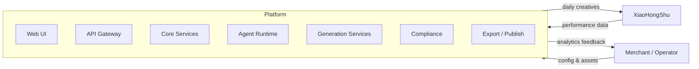

### Key capabilities

| Capability | Description |
|---|---|
| **Automated daily creative generation** | Agent teams produce fresh notes and ad variants every day, driven by product truth and trend signals |
| **Quarterly asset refresh** | Structured ingestion of seasonal packshots, cutouts, and brand assets that feed the stable truth layer |
| **Compliance-first pipeline** | Every creative passes through banned-word, claim-validation, style-risk, and product-fidelity checks before human review |
| **Multi-surface export** | Output is packaged for 笔记, 聚光, and 蒲公英 with surface-specific formatting and metadata |
| **Performance-driven ranking** | Historical analytics feed a ranking model that surfaces the highest-potential variants for review |
| **Configurable agent personas** | Operators can swap persona definitions (tone, vocabulary, risk appetite) without changing the underlying agent role logic |

---

## 2. Architectural Principles

### 2.1 Two-Clock Architecture

The system operates on two distinct temporal cadences:

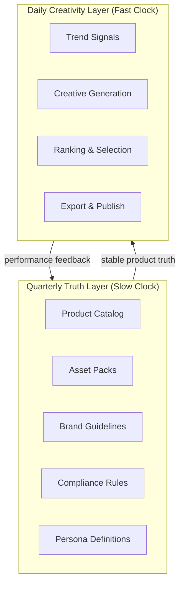

- **Quarterly Truth Layer (slow clock):** Product catalog, brand assets, compliance rulesets, persona definitions, and team compositions. These change infrequently and undergo formal review. They represent the stable, validated ground truth that all creative generation builds upon.
- **Daily Creativity Layer (fast clock):** Trend research, copy generation, image composition, compliance checking, ranking, and export. These run on daily (or on-demand) cadences and are designed for high throughput and rapid iteration.

This separation ensures that creative velocity never compromises product accuracy, and that truth-layer updates propagate cleanly without destabilizing in-flight generation pipelines.

### 2.2 Role-Persona Separation

AI agents are structured in two orthogonal layers:

- **Role:** A fixed operational responsibility (e.g., Copywriter, Art Director, Compliance Reviewer). Roles define *what* the agent does — its tools, inputs, outputs, and position in the pipeline.
- **Persona:** A configurable behavioral profile (e.g., "Gen-Z casual tone", "luxury minimalist"). Personas define *how* the agent behaves — its vocabulary, risk appetite, stylistic preferences, and cultural references.

Roles are owned by the platform engineering team. Personas are owned by merchant operators and can be versioned, A/B tested, and swapped without code changes.

### 2.3 Contract-First, Schema-Validated Modules

Every service boundary is defined by an explicit contract:

- **API contracts** are OpenAPI 3.1 specs, validated at build time.
- **Inter-service messages** use JSON Schema with strict validation at both producer and consumer.
- **Agent inputs/outputs** are Pydantic models with structured output validation — malformed generations are rejected and retried.
- **Prompt templates** are versioned artifacts with declared input schemas.

No implicit coupling. If it crosses a boundary, it has a schema.

### 2.4 Bounded Contexts with Clear Service Boundaries

Each service owns its data, its domain logic, and its API surface. Cross-service communication happens exclusively through:

1. **Synchronous REST/gRPC** for queries and commands with low-latency requirements.
2. **Redis Streams** for asynchronous event propagation.
3. **Temporal workflows** for multi-step orchestration that must survive failures.

No service reads another service's database directly.

---

## 3. Top-Level Services

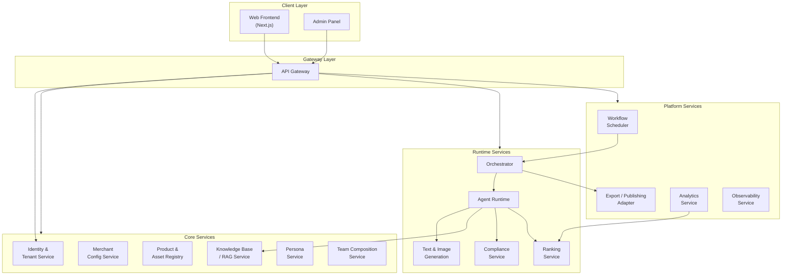

| # | Service | Responsibility |
|---|---|---|
| 1 | **Frontend** | Next.js + TypeScript SPA. Merchant workspace for config, review, approval, and analytics dashboards. |
| 2 | **API Gateway** | Request routing, rate limiting, tenant context injection, JWT validation. Single entry point for all client traffic. |
| 3 | **Identity & Tenant Service** | Authentication, authorization, tenant provisioning, RBAC, team member management. |
| 4 | **Merchant Config Service** | Merchant profile, industry vertical, tone presets, banned/required claims, review workflow settings. |
| 5 | **Product & Asset Registry** | Product catalog, quarterly asset packs (packshots, cutouts, logos, packaging refs), asset approval state machine. |
| 6 | **Knowledge Base / RAG Service** | Brand guidelines, successful past creatives, product facts, note-writing templates, compliance guidance, campaign learnings. Backed by pgvector for semantic retrieval. |
| 7 | **Orchestrator** | Receives generation requests (scheduled or on-demand), resolves the active team composition, and drives the agent pipeline via Temporal workflows. |
| 8 | **Agent Runtime** | Executes individual agent steps: loads the role definition, applies the persona overlay, calls tools (LLM, image gen, retrieval, compliance), and returns structured output. |
| 9 | **Text & Image Generation Service** | Thin wrapper around LLM and diffusion model APIs. Manages prompt construction, model routing, retry logic, token budgeting, and structured output parsing. |
| 10 | **Compliance Service** | Rule engine for banned words, unsupported claims, style/IP risks, category-specific rules, product-fidelity checks, and hard-sell risk scoring. |
| 11 | **Ranking Service** | Scores creative variants using historical analytics, compliance pass rate, diversity metrics, and fatigue signals. Surfaces top-N candidates for human review. |
| 12 | **Analytics Service** | Ingests XiaoHongShu performance data (impressions, clicks, saves, comments, conversions, costs). Computes fatigue scores and feeds the ranking model. |
| 13 | **Workflow Scheduler** | Temporal-based scheduler for daily generation runs, weekly performance digests, quarterly asset refresh flows, and ad-hoc retry/reprocessing. |
| 14 | **Export / Publishing Adapter** | Packages approved creatives into surface-specific bundles (笔记-ready, 聚光-ready, 蒲公英-ready) with correct image specs, text formatting, and metadata. |
| 15 | **Persona Service** | CRUD and versioning for persona definitions. Manages persona constraints, behavior settings, test history, and A/B experiment metadata. |
| 16 | **Team Composition Service** | Defines agent-team templates, maps roles to personas, manages collaboration graphs and team version history. |
| 17 | **Observability Service** | Aggregates OpenTelemetry traces, metrics, and logs. Provides generation lineage (prompt version → model version → output → compliance result → ranking score → review action → export). |

---

## 4. Technology Stack

| Layer | Technology | Rationale |
|---|---|---|
| **Frontend** | Next.js 14+ / TypeScript / Tailwind CSS | SSR for China CDN compatibility, type safety, rapid UI iteration |
| **API** | FastAPI (Python 3.12+) | Native async, Pydantic validation, OpenAPI auto-generation, strong ML/AI ecosystem |
| **Scheduler / Orchestration** | Temporal | Durable workflows, built-in retry/timeout, visibility into long-running pipelines |
| **Queue** | Redis Streams | Lightweight event bus, consumer groups for fan-out, low operational overhead |
| **Database** | PostgreSQL 16+ | ACID, JSONB for semi-structured data, row-level security for tenant isolation |
| **Vector Store** | pgvector (PostgreSQL extension) | Co-located with relational data, avoids a separate vector DB, good-enough recall for RAG |
| **Object Storage** | S3-compatible (MinIO for dev, Alibaba Cloud OSS for prod) | Asset storage for images, packshots, generated creatives |
| **Cache** | Redis | Session cache, rate-limit counters, hot config cache |
| **Monitoring** | OpenTelemetry + Grafana + Sentry | Distributed tracing, dashboards, error tracking |
| **Auth** | JWT-based (short-lived access + refresh tokens) | Stateless validation at gateway, tenant claims embedded in token |
| **Container Runtime** | Docker + Kubernetes | Standard orchestration, horizontal scaling, rolling deploys |
| **CI/CD** | GitHub Actions | Monorepo-aware builds, per-service deploy pipelines |
| **IaC** | Terraform | Cloud-agnostic provisioning (targeting Alibaba Cloud primarily) |

---

## 5. Monorepo Layout

```
repo/
├── apps/
│   ├── web/                        # Next.js merchant-facing frontend
│   ├── api/                        # FastAPI backend (gateway + core routes)
│   ├── worker/                     # Background workers (Temporal activities)
│   └── admin/                      # Internal admin panel
│
├── packages/
│   ├── ui/                         # Shared React UI component library
│   ├── config/                     # Shared configuration schemas & loaders
│   ├── db/                         # SQLAlchemy models, Alembic migrations
│   ├── types/                      # Shared TypeScript type definitions
│   ├── prompts/                    # Versioned prompt templates (YAML + schemas)
│   ├── agent-sdk/                  # Agent framework: role definitions, persona loading, tool registry
│   ├── xhs-domain/                 # XiaoHongShu domain logic (note formats, ad specs, API adapters)
│   ├── compliance-rules/           # Compliance rule definitions (YAML + evaluation engine)
│   └── analytics/                  # Analytics models, fatigue scoring, data transformers
│
├── services/
│   ├── asset-service/              # Product & asset registry service
│   ├── knowledge-service/          # RAG / knowledge base service
│   ├── generation-service/         # Text & image generation service
│   ├── compliance-service/         # Compliance evaluation service
│   ├── ranking-service/            # Creative ranking service
│   ├── workflow-service/           # Temporal workflow definitions & scheduler
│   ├── export-service/             # Export & publishing adapter service
│   ├── persona-service/            # Persona management service
│   └── team-composition-service/   # Team composition management service
│
├── infra/
│   ├── terraform/                  # Infrastructure-as-code
│   ├── docker/                     # Dockerfiles and compose configs
│   ├── k8s/                        # Kubernetes manifests / Helm charts
│   └── scripts/                    # Dev scripts (seed data, migrations, local setup)
│
├── docs/
│   ├── prd/                        # Product requirements documents
│   ├── architecture/               # Architecture documents (this file)
│   ├── runbooks/                   # Operational runbooks
│   ├── api/                        # API reference (auto-generated from OpenAPI)
│   └── prompts/                    # Prompt engineering documentation
│
├── .github/                        # CI/CD workflows
├── pyproject.toml                  # Python workspace root
├── package.json                    # Node workspace root
├── turbo.json                      # Turborepo pipeline config
└── README.md
```

### Dependency graph between packages

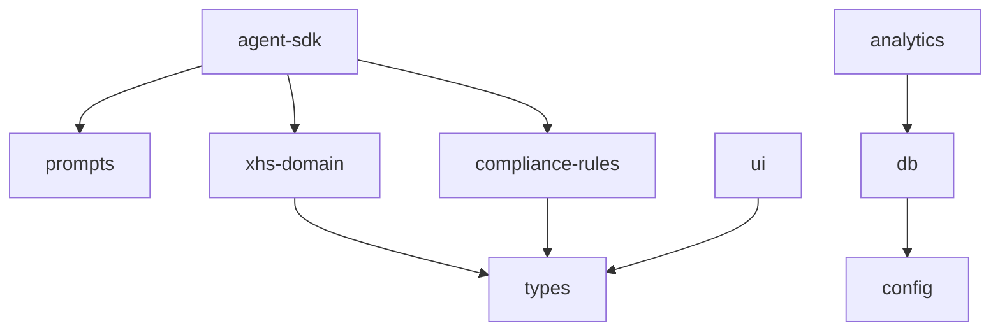

---

## 6. Bounded Contexts

Each bounded context owns its domain model, persistence, and API surface. Below is a detailed breakdown.

### 6.1 Merchant Service

**Owner:** `apps/api` + `packages/db`

| Concept | Description |
|---|---|
| Merchant Profile | Business name, category, industry vertical, target demographics |
| Tone Presets | Predefined tone configurations (e.g., "professional", "playful Gen-Z", "luxury understated") |
| Banned / Required Claims | Merchant-specific claim rules that layer on top of platform compliance |
| Review Settings | Approval workflow configuration: auto-approve threshold, required reviewers, escalation rules |

**Key invariants:**
- Every merchant belongs to exactly one tenant.
- Tone presets are versioned; active preset is immutable once a generation run references it.

### 6.2 Product & Asset Service

**Owner:** `services/asset-service` + `packages/db`

| Concept | Description |
|---|---|
| Product | SKU-level entity: name, description, category, claims, ingredients/materials, price point |
| Quarterly Asset Pack | Seasonal bundle of visual assets tied to a product line |
| Packshots | Official product photography |
| Cutouts | Background-removed product images for compositing |
| Logos | Brand and sub-brand logos in multiple formats |
| Packaging Refs | Reference images of physical packaging |
| Approval State | State machine: `draft → pending_review → approved → archived` |

**Key invariants:**
- Assets in `approved` state are immutable.
- A quarterly asset pack must have at least one approved packshot before it can be activated.
- Products reference assets by stable ID; asset replacement creates a new version, not an in-place mutation.

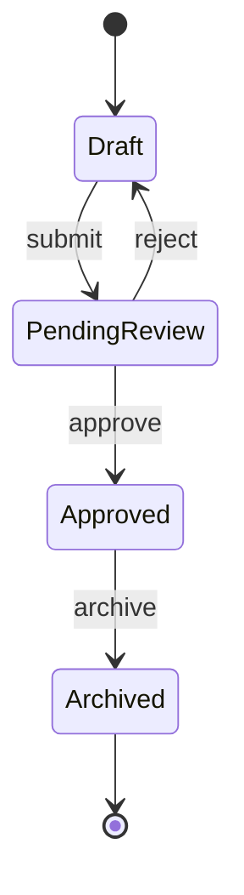

### 6.3 Knowledge Base Service

**Owner:** `services/knowledge-service`

| Concept | Description |
|---|---|
| Brand Guidelines | Uploaded brand books, style guides, voice & tone documents |
| Successful Past Creatives | High-performing historical notes with performance metadata |
| Product Facts | Structured claims, ingredients, certifications, awards |
| Note-Writing Templates | Proven XiaoHongShu note structures (hook patterns, CTA formulas) |
| Compliance Guidance | Interpreted compliance rules in natural language for agent consumption |
| Campaign Learnings | Aggregated insights from past campaigns (what worked, what didn't) |

All documents are chunked, embedded (via text-embedding model), and stored in pgvector for semantic retrieval. The RAG pipeline supports:

- **Hybrid search:** keyword (BM25 via pg_trgm) + semantic (cosine similarity via pgvector).
- **Tenant-scoped retrieval:** queries are always filtered by `tenant_id`.
- **Recency weighting:** recent campaign learnings are boosted.

### 6.4 Generation Service

**Owner:** `services/generation-service`

| Concept | Description |
|---|---|
| Prompt Construction | Assembles final prompts from templates + product truth + retrieved knowledge + persona instructions |
| LLM Text Generation | Calls text models (e.g., Qwen, GPT-4o) with structured output schemas |
| Image Editing / Generation | Composites product cutouts onto lifestyle backgrounds, generates supplementary imagery |
| Variant Packaging | Produces multiple creative variants per product per run |
| Structured Output Validation | Validates LLM output against Pydantic schemas; rejects and retries on failure |

**Key invariants:**
- Every generation request produces a lineage record: `(prompt_version, model_version, input_hash, output_hash, timestamp)`.
- Failed structured output validation triggers up to 3 retries with escalating prompt specificity.
- Image generation requests include product-fidelity constraints (approved packshots must appear unmodified).

### 6.5 Compliance Service

**Owner:** `services/compliance-service` + `packages/compliance-rules`

| Check | Description |
|---|---|
| Banned Words | Dictionary of prohibited terms, updated per category and regulatory changes |
| Unsupported Claims | Claims that lack evidence or regulatory approval (e.g., "cures acne") |
| Style / IP Risks | Detection of copyrighted imagery references, celebrity likeness, trademark misuse |
| Category Rules | Category-specific regulations (cosmetics, food, health supplements each have distinct rules) |
| Product Fidelity | Ensures generated imagery faithfully represents the actual product |
| Hard-Sell Risk | Scores copy for aggressive sales language that violates XiaoHongShu community guidelines |

Compliance is evaluated as a **scoring pipeline**, not a binary gate:

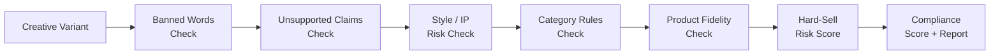

Each check produces a score and a list of findings. The aggregate compliance score determines whether the variant is auto-approved, flagged for review, or auto-rejected.

### 6.6 Workflow Service

**Owner:** `services/workflow-service`

| Schedule | Description |
|---|---|
| **Daily** | Generate fresh creative variants for all active products across all tenants |
| **Weekly** | Performance digest: pull analytics, update fatigue scores, retrain ranking signals |
| **Quarterly** | Asset refresh: ingest new asset packs, re-baseline product truth, regenerate reference embeddings |
| **Real-time** | On-demand generation triggered by merchant via UI |
| **Review** | Orchestrate human review workflows: assign reviewers, track approvals, handle escalations |

All workflows are implemented as **Temporal workflows** with:
- Deterministic replay for debugging.
- Automatic retry with exponential backoff.
- Heartbeat-based timeout detection.
- Visibility queries for operational dashboards.

### 6.7 Analytics Service

**Owner:** `services/analytics` + `packages/analytics`

| Metric | Description |
|---|---|
| Impressions | Note view count |
| Clicks | Click-through count |
| Saves (收藏) | Bookmark count — strong engagement signal on XiaoHongShu |
| Comments | Comment count and sentiment |
| Conversions | Tracked purchase or lead events |
| Costs | Ad spend per creative (聚光/蒲公英) |
| Fatigue Score | Computed metric indicating audience saturation for a creative or product angle |

The analytics service:
1. Ingests data from XiaoHongShu APIs (or manual CSV uploads as fallback).
2. Computes derived metrics (CTR, save rate, cost-per-conversion, fatigue score).
3. Feeds the ranking service with performance signals.
4. Generates merchant-facing dashboards.

### 6.8 Export Service

**Owner:** `services/export-service` + `packages/xhs-domain`

| Export Target | Description |
|---|---|
| **笔记-ready** | Native note format: cover image (1:1 or 3:4), title (≤20 chars), body (≤1000 chars), hashtags, @mentions |
| **聚光-ready** | Spotlight ad format: ad creative image, headline, description, CTA, targeting metadata |
| **蒲公英-ready** | Dandelion collaboration format: brief, reference creatives, talking points, KOL/KOC matching metadata |

Each export bundle includes:
- Final images in required dimensions and formats.
- Copy with character-count validation.
- Metadata JSON conforming to the target surface's schema.
- Compliance report summary.

### 6.9 Persona Service

**Owner:** `services/persona-service`

| Concept | Description |
|---|---|
| Persona Definition | Named behavioral profile: tone, vocabulary, risk appetite, cultural references, stylistic preferences |
| Versions | Immutable snapshots; active version is pinned per team composition |
| Constraints | Hard limits on persona behavior (e.g., "never use slang", "always include disclaimer") |
| Behavior Settings | Tunable parameters: creativity temperature, formality level, emoji density, sentence length distribution |
| Test History | Record of A/B tests comparing persona variants, with performance outcomes |

**Key invariants:**
- A persona version is immutable once referenced by any generation run.
- Persona constraints are enforced at the Agent Runtime level before output is emitted.
- Test history links persona versions to analytics outcomes for data-driven persona tuning.

### 6.10 Team Composition Service

**Owner:** `services/team-composition-service`

| Concept | Description |
|---|---|
| Agent-Team Template | Predefined team structure (e.g., "Standard Note Team": Researcher + Copywriter + Art Director + Compliance Reviewer) |
| Role-to-Persona Mapping | Binds a specific persona version to each role in the team |
| Collaboration Graph | Defines the execution order and data flow between agents in the team |
| Team Versions | Immutable snapshots of the full team configuration |

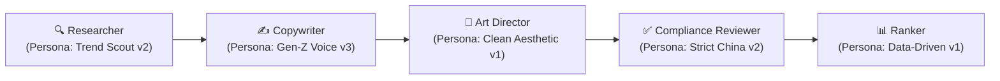

---

## 7. Data Flow

### 7.1 Daily Auto Generation

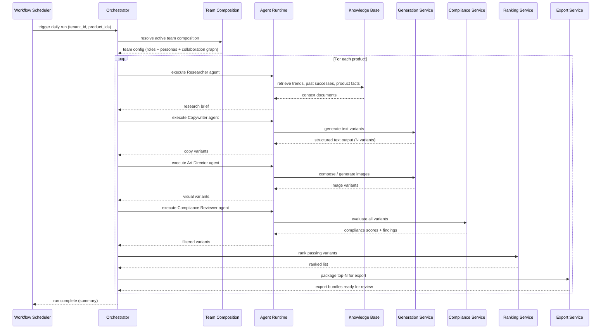

**Step-by-step:**

1. **Trigger:** The Workflow Scheduler fires the daily generation Temporal workflow for each active tenant.
2. **Team Resolution:** The Orchestrator resolves the tenant's active team composition — which roles, which persona versions, and the collaboration graph.
3. **Research Phase:** The Researcher agent queries the Knowledge Base for trend signals, successful past creatives, and product facts. Outputs a structured research brief.
4. **Copywriting Phase:** The Copywriter agent receives the research brief + product truth and generates N text variants via the Generation Service. Each variant is validated against the structured output schema.
5. **Art Direction Phase:** The Art Director agent composes images by combining approved product assets with generated backgrounds/layouts. Outputs image variants.
6. **Compliance Phase:** The Compliance Reviewer agent sends all variants through the Compliance Service pipeline. Variants below the threshold are rejected with findings.
7. **Ranking Phase:** Passing variants are scored by the Ranking Service using historical performance signals and diversity metrics.
8. **Export Phase:** Top-ranked variants are packaged into surface-specific export bundles and queued for merchant review.

### 7.2 On-Demand Request

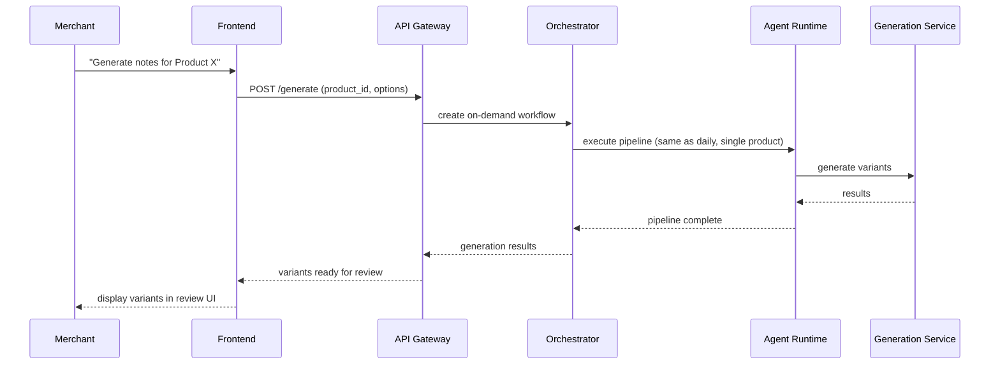

On-demand requests follow the same agent pipeline as daily generation but:
- Target a single product (or a merchant-selected subset).
- May include merchant-provided overrides (e.g., "focus on ingredient X", "use festive theme").
- Are executed with higher priority in the Temporal task queue.
- Return results synchronously to the UI via WebSocket progress updates.

### 7.3 Quarterly Asset Refresh

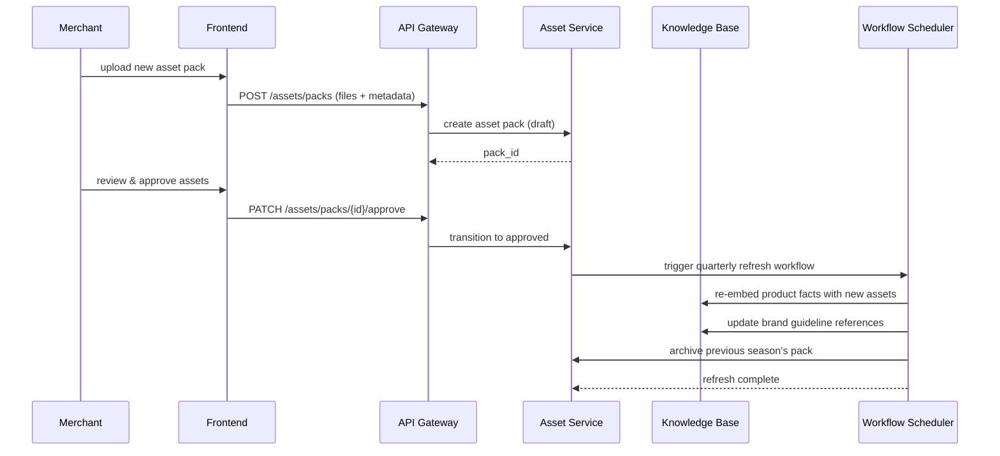

The quarterly refresh:
1. Merchant uploads a new seasonal asset pack via the UI.
2. Assets go through the `draft → pending_review → approved` state machine.
3. Upon approval, a Temporal workflow triggers re-embedding of product facts and brand guidelines that reference the updated assets.
4. The previous season's asset pack is archived (remains queryable but no longer used in new generation runs).
5. Subsequent daily generation runs automatically pick up the new assets from the truth layer.

---

## 8. Agent Runtime Architecture

### 8.1 Two-Layer Agent Model

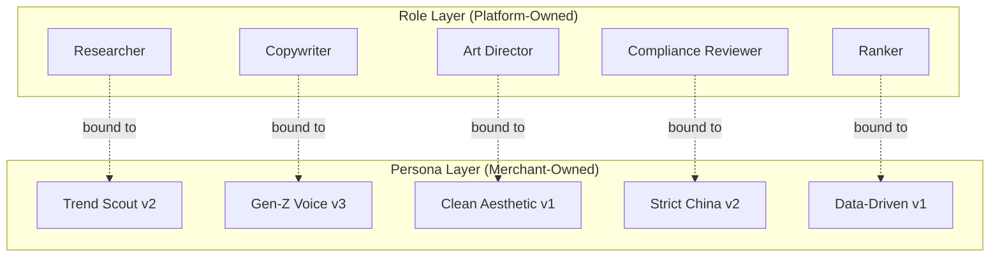

#### Role Layer (fixed operational responsibilities)

Each role defines:
- **Input schema:** What data the agent receives (e.g., Researcher receives `product_id`, `tenant_config`).
- **Output schema:** What structured data the agent must produce (e.g., Researcher outputs `ResearchBrief`).
- **Tool access:** Which services/APIs the agent can call (e.g., Researcher can call Knowledge Base; Copywriter can call Generation Service).
- **Position in pipeline:** Where in the collaboration graph this role executes.

Roles are **code artifacts** — changing a role requires a code review and deployment.

#### Persona Layer (configurable behavior)

Each persona defines:
- **System prompt overlay:** Injected into the agent's system prompt to shape tone, vocabulary, and style.
- **Behavioral parameters:** Temperature, formality level, emoji usage, sentence length preferences.
- **Hard constraints:** Non-negotiable rules (e.g., "never reference competitor brands").
- **Cultural context:** Region-specific references, holiday awareness, platform trend vocabulary.

Personas are **data artifacts** — merchants create and version them through the UI without code changes.

### 8.2 Agent Execution Flow

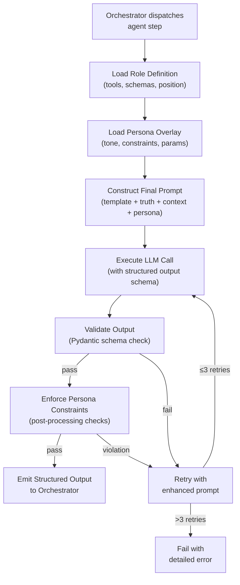

### 8.3 Inter-Agent Communication

Agents within a pipeline do not communicate directly. Instead:

1. Each agent produces a **typed output artifact** (e.g., `ResearchBrief`, `CopyVariantSet`, `ImageVariantSet`).
2. The Orchestrator stores the artifact and passes it as input to the next agent in the collaboration graph.
3. This ensures:
   - Full observability (every intermediate artifact is logged).
   - Replay capability (any agent step can be re-executed with the same inputs).
   - Substitutability (an agent can be swapped without affecting upstream/downstream).

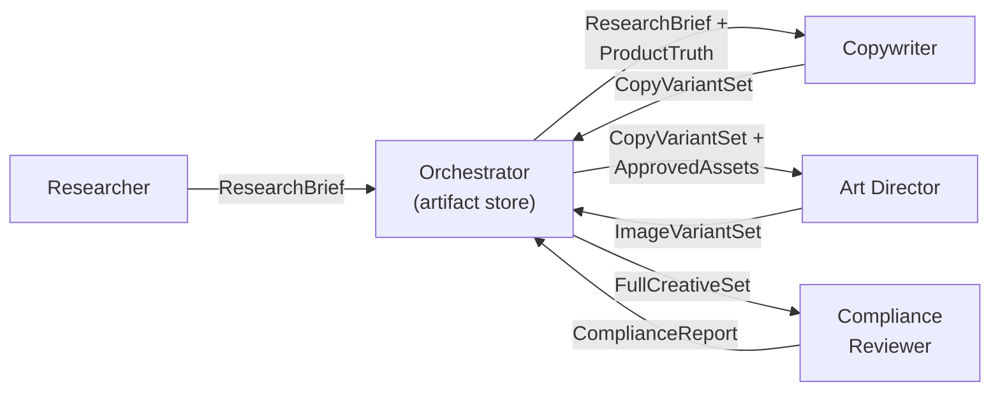

---

## 9. Security and Multi-Tenancy

### 9.1 Tenant Isolation

GenPos enforces strict tenant isolation at every layer:

| Layer | Isolation Mechanism |
|---|---|
| **API Gateway** | JWT contains `tenant_id` claim; injected into request context on every call |
| **Application** | All service queries include `tenant_id` filter; enforced by middleware, not optional per-query |
| **Database** | PostgreSQL Row-Level Security (RLS) policies on all tenant-scoped tables; `tenant_id` set via `SET app.current_tenant` on each connection |
| **Object Storage** | Tenant-prefixed S3 paths: `s3://{bucket}/{tenant_id}/...` |
| **Vector Store** | pgvector queries filtered by `tenant_id` column; no cross-tenant semantic leakage |
| **Agent Runtime** | Each agent execution is scoped to a single tenant; context injection enforces boundary |
| **Redis** | Key prefixed with `tenant:{tenant_id}:` for all cached data |

### 9.2 API Authentication

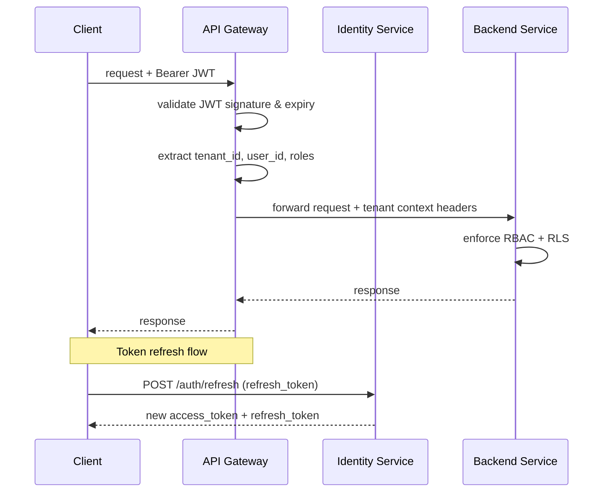

- **Access tokens:** Short-lived (15 min), signed with RS256.
- **Refresh tokens:** Longer-lived (7 days), stored hashed in database, rotated on use.
- **API keys:** For service-to-service communication within the cluster, using mutual TLS + API key headers.
- **RBAC roles:** `owner`, `admin`, `editor`, `viewer` — with granular permissions per resource type.

### 9.3 Data Segregation

- **At rest:** All tenant data is encrypted using AES-256. Encryption keys are managed per-tenant via a KMS.
- **In transit:** All inter-service communication uses TLS 1.3. External API calls use HTTPS.
- **Backups:** Tenant-scoped logical backups. Restore operations are tenant-isolated.
- **Deletion:** Tenant offboarding triggers a cascading soft-delete across all services, followed by a hard-delete workflow after a 30-day grace period.

---

## 10. Observability

### 10.1 Tracing Strategy

Every generation request produces an end-to-end **OpenTelemetry trace** spanning all services involved. The trace carries a `generation_id` as its root span tag, enabling full lineage reconstruction.

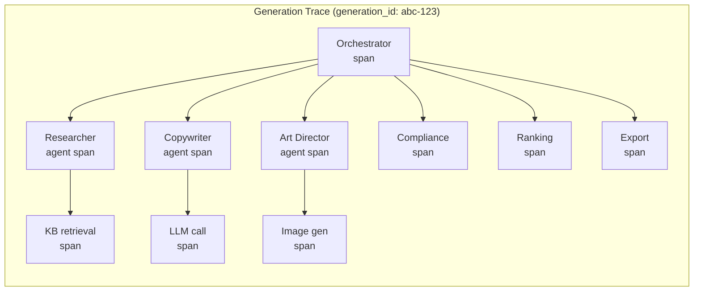

### 10.2 Tracked Dimensions

Every generation trace records the following dimensions as span attributes and structured logs:

| Dimension | Description | Example |
|---|---|---|
| `prompt_version` | Version hash of the prompt template used | `tmpl:copywriter:v3.2.1` |
| `model_version` | Model identifier and version | `qwen-max-2025-12` |
| `product_assets_used` | List of asset IDs referenced in generation | `[asset:pack42:cutout-3, asset:pack42:logo-1]` |
| `compliance_failures` | List of compliance check failures | `[banned_word:"最好", claim:unverified_whitening]` |
| `compliance_score` | Aggregate compliance score (0-100) | `87` |
| `ranking_score` | Final ranking score for the variant | `0.73` |
| `review_action` | Human review outcome | `approved` / `rejected` / `revised` |
| `export_action` | Export target and status | `xiaohongshu_note:published` |
| `active_team` | Team composition version | `team:standard-note:v2.1` |
| `active_persona_mapping` | Role → persona version mapping | `{copywriter: "gen-z-v3", art_dir: "clean-v1"}` |
| `token_usage` | Input/output token counts per LLM call | `{input: 2340, output: 512}` |
| `latency_ms` | Per-step and total pipeline latency | `{total: 45200, copywriter: 12300}` |
| `tenant_id` | Tenant identifier (for cross-tenant dashboards) | `tenant:acme-beauty` |

### 10.3 Monitoring Stack

| Component | Role |
|---|---|
| **OpenTelemetry SDK** | Instrumentation in every service (auto + manual spans) |
| **OpenTelemetry Collector** | Receives, processes, and exports telemetry data |
| **Grafana Tempo** | Distributed trace storage and querying |
| **Grafana Loki** | Log aggregation (structured JSON logs) |
| **Grafana** | Dashboards: generation throughput, compliance pass rate, latency percentiles, error rates, cost per generation |
| **Sentry** | Error tracking with source maps (frontend) and stack traces (backend) |
| **Alerting** | Grafana alerting rules → PagerDuty / DingTalk for on-call |

### 10.4 Key Dashboards

1. **Generation Pipeline Health:** Throughput, success rate, latency P50/P95/P99, retry rate per agent step.
2. **Compliance Overview:** Pass rate by check type, top failure reasons, category breakdown.
3. **Ranking Effectiveness:** Correlation between ranking score and actual XiaoHongShu performance.
4. **Tenant Usage:** Generation volume, asset storage, API calls per tenant.
5. **Model Cost:** Token usage and cost breakdown by model, tenant, and pipeline step.
6. **Agent Performance:** Per-persona success rate, retry rate, and output quality metrics.

---

## 11. Deployment Architecture

### 11.1 Container Strategy

Every service is packaged as a Docker container with:
- Multi-stage builds (builder → runtime) for minimal image size.
- Non-root user execution.
- Health check endpoints (`/healthz`, `/readyz`).
- Graceful shutdown handling (SIGTERM → drain connections → exit).

### 11.2 Kubernetes Orchestration

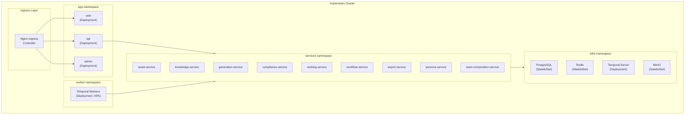

**Scaling strategy:**
- **Stateless services** (API, generation, compliance, ranking): Horizontal Pod Autoscaler (HPA) based on CPU/memory and custom metrics (queue depth).
- **Workers:** HPA based on Temporal task queue backlog.
- **Databases:** Vertical scaling + read replicas. Connection pooling via PgBouncer.
- **Redis:** Sentinel for HA; cluster mode if throughput demands it.

### 11.3 CI/CD Pipeline

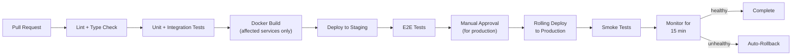

**Key properties:**
- **Monorepo-aware:** Only affected services are built and deployed (detected via dependency graph + changed files).
- **Environment promotion:** `main` → staging (auto) → production (manual gate).
- **Canary deploys:** Production deployments use canary strategy — 10% traffic for 15 minutes, then full rollout.
- **Rollback:** Automatic rollback on error rate spike (>5% 5xx) or latency degradation (>2x P95).
- **Database migrations:** Run as a pre-deploy job; backward-compatible only (expand-then-contract pattern).

### 11.4 Environment Topology

| Environment | Purpose | Infrastructure |
|---|---|---|
| **Local** | Developer workstation | Docker Compose + MinIO + local PostgreSQL |
| **CI** | Automated testing | Ephemeral containers in GitHub Actions |
| **Staging** | Pre-production validation | Kubernetes cluster (smaller, mirrors prod topology) |
| **Production** | Live traffic | Kubernetes cluster on Alibaba Cloud (ACK) |

---

## Appendix A: ADR Index

Architecture Decision Records are tracked in `docs/architecture/adr/`. Key decisions:

| ADR | Decision |
|---|---|
| ADR-001 | Use Temporal over Celery for workflow orchestration |
| ADR-002 | pgvector over dedicated vector DB (Pinecone/Weaviate) |
| ADR-003 | Role-persona separation for agent architecture |
| ADR-004 | Two-clock architecture (quarterly truth + daily creativity) |
| ADR-005 | PostgreSQL RLS for tenant isolation over schema-per-tenant |
| ADR-006 | Monorepo over polyrepo |
| ADR-007 | FastAPI over Django for API layer |
| ADR-008 | Redis Streams over Kafka for event bus |

---

## Appendix B: Glossary

| Term | Definition |
|---|---|
| **笔记 (bǐjì)** | XiaoHongShu native note/post format |
| **聚光 (jùguāng)** | XiaoHongShu Spotlight — paid search ad product |
| **蒲公英 (púgōngyīng)** | XiaoHongShu Dandelion — KOL/KOC collaboration platform |
| **KOL** | Key Opinion Leader — high-follower influencer |
| **KOC** | Key Opinion Consumer — micro-influencer / authentic reviewer |
| **Packshot** | Official product photography on clean background |
| **Cutout** | Background-removed product image for compositing |
| **Fatigue Score** | Metric indicating audience saturation for a creative angle |
| **Truth Layer** | Quarterly-updated stable product data (catalog, assets, guidelines) |
| **Creativity Layer** | Daily-updated fast-moving creative generation pipeline |
| **Role** | Fixed operational responsibility of an AI agent |
| **Persona** | Configurable behavioral profile applied to an agent role |
| **Team Composition** | A versioned mapping of roles → personas with a collaboration graph |
