# GenPos — Workflow DAGs

> **Version:** 0.1.0-draft
> **Last updated:** 2026-03-12
> **Status:** Living document — evolves with the system
> **Parent:** [ARCHITECTURE.md](./ARCHITECTURE.md) § 6.6 (Workflow Service)
> **Related:** [AGENT_TEAM_SPEC.md](./AGENT_TEAM_SPEC.md) § 6 (Orchestration Pipeline)

---

## Table of Contents

1. [Overview](#1-overview)
2. [Daily Generation DAG](#2-daily-generation-dag)
3. [On-Demand Generation DAG](#3-on-demand-generation-dag)
4. [Quarterly Asset Refresh DAG](#4-quarterly-asset-refresh-dag)
5. [Weekly Learning DAG](#5-weekly-learning-dag)
6. [Persona/Team Experiment DAG](#6-personateam-experiment-dag)
7. [Temporal Workflow Implementation Notes](#7-temporal-workflow-implementation-notes)
8. [Error Handling Strategy](#8-error-handling-strategy)
9. [Monitoring and Observability](#9-monitoring-and-observability)

---

## 1. Overview

GenPos orchestrates all multi-step work through **Temporal workflows**. Each workflow is modeled as a Directed Acyclic Graph (DAG) where nodes are Temporal Activities and edges represent data dependencies between them. This document defines all five workflow DAGs, their scheduling, retry policies, error handling, and monitoring contracts.

### Workflow Inventory

| # | Workflow | Cadence | Trigger | Typical Duration |
|---|---------|---------|---------|------------------|
| 1 | **Daily Generation** | Daily 03:00 CST | Cron schedule | 30–120 min per merchant |
| 2 | **On-Demand Generation** | Real-time | User request (API / chat) | 30s–5 min |
| 3 | **Quarterly Asset Refresh** | Quarterly | Manual (merchant initiates) | Minutes–24 hours (includes human approval) |
| 4 | **Weekly Learning** | Weekly Mon 05:00 CST | Cron schedule | 10–60 min per merchant |
| 5 | **Persona/Team Experiment** | Ad-hoc | Manual (experiment API) | 1–4 hours |

### How Workflows Relate to the Two-Clock Architecture

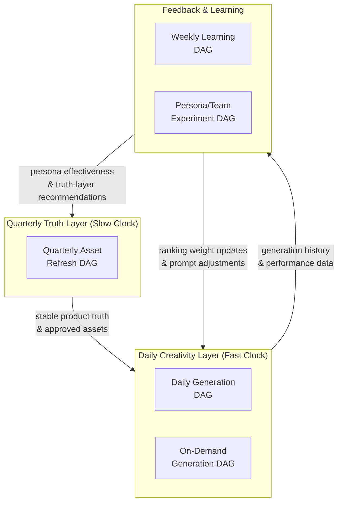

### Workflow ID Convention

All Temporal Workflow IDs follow a deterministic naming pattern to ensure idempotency and debuggability:

| Workflow | ID Pattern | Example |
|----------|-----------|---------|
| Daily Generation | `daily-gen:{merchant_id}:{YYYY-MM-DD}` | `daily-gen:m_abc123:2026-03-12` |
| On-Demand Generation | `ondemand-gen:{merchant_id}:{job_id}` | `ondemand-gen:m_abc123:job_x7k9` |
| Quarterly Asset Refresh | `asset-refresh:{merchant_id}:{pack_id}` | `asset-refresh:m_abc123:pack_q2` |
| Weekly Learning | `weekly-learn:{merchant_id}:{YYYY-Www}` | `weekly-learn:m_abc123:2026-W11` |
| Persona Experiment | `experiment:{merchant_id}:{experiment_id}` | `experiment:m_abc123:exp_ab01` |

---

## 2. Daily Generation DAG

The primary production workflow. Runs every night to produce fresh creative variants for all active products across all merchants.

### 2.1 Schedule & Constraints

| Property | Value |
|----------|-------|
| **Schedule** | Daily at `03:00 Asia/Shanghai` |
| **Timeout** | 2 hours max per merchant |
| **Retry policy** | 3 retries with exponential backoff (initial interval 10s, backoff coefficient 2.0, max interval 5 min) for transient failures |
| **Concurrency** | One workflow instance per merchant per day (enforced by deterministic Workflow ID) |
| **Task queue** | `daily-generation` |
| **Error handling** | Per-product isolation — one product failure does not block others |

### 2.2 DAG Definition

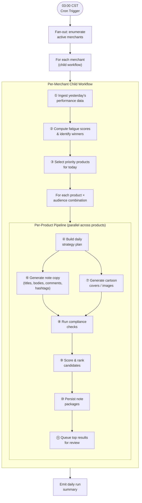

### 2.3 Step Details

| Step | Activity | Agent / Service | Input | Output | Timeout | Retries |
|------|----------|----------------|-------|--------|---------|---------|
| ① | `IngestPerformanceData` | Analytics Service | `merchant_id`, date range | Updated `performance_metrics` rows | 2 min | 3 |
| ② | `ComputeFatigueScores` | Analytics Service + Ranking Service | Performance history, generation history | Fatigue scores per product × angle | 3 min | 2 |
| ③ | `SelectPriorityProducts` | Orchestrator | Product catalog, fatigue scores, merchant config | Ordered list of `(product_id, audience)` pairs | 30s | 2 |
| ④ | `BuildStrategyPlan` | Strategy Planner Agent | `StructuredJobRequest` + product truth + performance history + trends | `StrategyPlan` | 60s | 3 |
| ⑤ | `ResolveTeamComposition` | Team Composition Service | `merchant_id`, `team_id` | `ResolvedTeamComposition` | 10s | 2 |
| ⑥ | `GenerateNoteCopy` | XHS Note Writer Agent → Generation Service | `StrategyPlan` + product truth + brand rules + persona | `NoteContentSet` | 90s | 3 |
| ⑦ | `GenerateVisuals` | Cartoon Visual Designer Agent → Generation Service | `StrategyPlan` + approved assets + brand visuals + persona | `VisualAssetSet` | 120s | 3 |
| ⑧ | `RunComplianceChecks` | Compliance Reviewer Agent → Compliance Service | `NoteContentSet` + `VisualAssetSet` + compliance rules | `ComplianceReport` | 60s | 2 |
| ⑨ | `ScoreAndRank` | Ranking Analyst Agent → Ranking Service | Compliant variants + performance history + fatigue signals | `RankingResult` | 30s | 2 |
| ⑩ | `PersistNotePackages` | Orchestrator → Database | `ExportBundleSet` | Persisted `note_packages`, `text_assets`, `image_assets` rows | 30s | 3 |
| ⑪ | `QueueForReview` | Orchestrator → Review Queue | Top-N ranked packages | Review queue entries with notification | 10s | 2 |

### 2.4 Parallel Execution

Steps ⑥ (note copy) and ⑦ (visual generation) run **in parallel** for each product since they share the same `StrategyPlan` input and have no data dependency on each other. Both must complete before step ⑧ (compliance) begins.

Products within a merchant's daily batch are processed with **bounded parallelism** (configurable, default 5 concurrent products) to manage LLM API rate limits and cost.

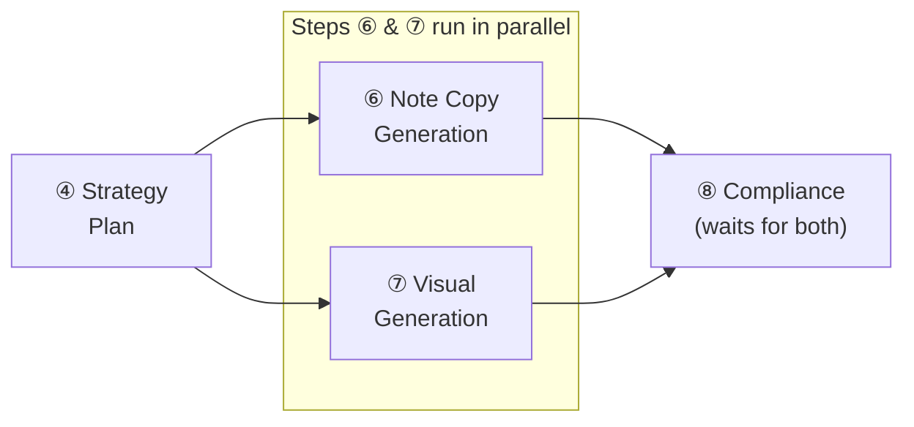

### 2.5 Fan-Out / Fan-In Pattern

The daily generation uses a **parent-child workflow** pattern:

1. **Parent workflow** (`DailyGenerationParent`): Enumerates active merchants, spawns one child workflow per merchant, collects summaries.
2. **Child workflow** (`DailyGenerationMerchant`): Handles all products for a single merchant. Isolated failure domain — if merchant A fails, merchant B is unaffected.
3. **Product-level isolation**: Within each child workflow, products are processed in parallel with individual error handling. A failed product is logged and skipped; remaining products continue.

---

## 3. On-Demand Generation DAG

Interactive, real-time generation triggered by a merchant request. Optimized for low latency and user-facing feedback.

### 3.1 Schedule & Constraints

| Property | Value |
|----------|-------|
| **Trigger** | User request via API (`POST /api/v1/generate`) or Founder Copilot chat |
| **Timeout** | 5 minutes total workflow execution |
| **Retry policy** | 2 retries for LLM/model failures (initial interval 5s, backoff coefficient 2.0) |
| **Concurrency** | Up to 3 concurrent on-demand workflows per merchant |
| **Task queue** | `on-demand-generation` (higher priority than daily queue) |
| **Progress updates** | WebSocket push to frontend on each activity completion |

### 3.2 DAG Definition

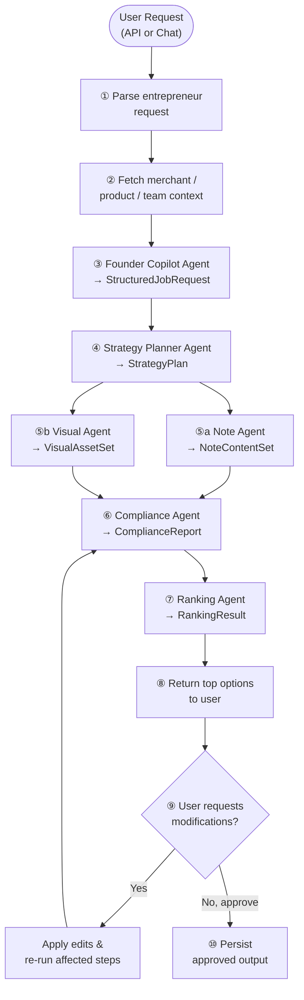

### 3.3 Step Details

| Step | Activity | Agent / Service | Timeout | Retries |
|------|----------|----------------|---------|---------|
| ① | `ParseRequest` | API Gateway | 5s | 0 |
| ② | `FetchContext` | Merchant Config + Product Registry + Team Composition | 10s | 2 |
| ③ | `RunFounderCopilot` | Founder Copilot Agent | 30s | 2 |
| ④ | `RunStrategyPlanner` | Strategy Planner Agent | 30s | 2 |
| ⑤a | `RunNoteAgent` | XHS Note Writer Agent | 60s | 2 |
| ⑤b | `RunVisualAgent` | Cartoon Visual Designer Agent | 90s | 2 |
| ⑥ | `RunComplianceAgent` | Compliance Reviewer Agent | 30s | 1 |
| ⑦ | `RunRankingAgent` | Ranking Analyst Agent | 15s | 1 |
| ⑧ | `ReturnResults` | API → WebSocket | 5s | 0 |
| ⑨ | `AwaitUserDecision` | Temporal Signal (`user_edit` / `user_approve`) | 30 min | N/A |
| ⑩ | `PersistApprovedOutput` | Database + Object Storage | 15s | 2 |

### 3.4 Edit Loop

The edit loop (step ⑨) uses **Temporal Signals** to implement human-in-the-loop interaction:

1. The workflow enters a blocking `workflow.wait_condition()` state after returning results.
2. The frontend sends a Temporal Signal with either `user_approve` or `user_edit` payload.
3. On `user_edit`: the workflow re-runs only the affected pipeline steps (e.g., if the user edits copy, only steps ⑤a → ⑥ → ⑦ are re-executed).
4. On `user_approve`: the workflow proceeds to step ⑩ and persists.
5. Signal timeout: if no signal is received within 30 minutes, the workflow auto-saves as draft and completes.

### 3.5 Differences from Daily Generation

| Dimension | Daily Generation | On-Demand Generation |
|-----------|-----------------|---------------------|
| Entry point | Scheduler-produced `StructuredJobRequest` | Founder Copilot Agent parses user intent |
| Product scope | All active products | Single product (or user-selected subset) |
| Parallelism | Batch across products | Single pipeline, steps ⑤a/⑤b parallel |
| Priority | Normal task queue | High-priority task queue |
| User feedback | None (async) | Real-time WebSocket updates |
| Edit loop | None | Interactive signal-based loop |
| Timeout | 2 hours per merchant | 5 minutes total |

---

## 4. Quarterly Asset Refresh DAG

Manages the ingestion, processing, approval, and activation of seasonal asset packs. This workflow touches the **truth layer** and includes human approval gates.

### 4.1 Schedule & Constraints

| Property | Value |
|----------|-------|
| **Trigger** | Manual — merchant initiates upload via UI |
| **Timeout** | 24 hours (includes human approval wait time) |
| **Retry policy** | 2 retries for image processing failures (initial interval 30s) |
| **Task queue** | `asset-refresh` |
| **Approval** | Temporal Signal-based human approval gate |

### 4.2 DAG Definition

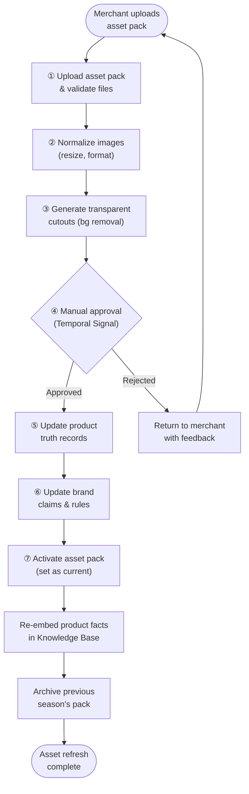

### 4.3 Step Details

| Step | Activity | Service | Timeout | Retries |
|------|----------|---------|---------|---------|
| ① | `UploadAndValidate` | Asset Service | 10 min | 1 |
| ② | `NormalizeImages` | Asset Service (image processing) | 15 min | 2 |
| ③ | `GenerateCutouts` | Asset Service (background removal model) | 30 min | 2 |
| ④ | `AwaitApproval` | Temporal Signal (`asset_approved` / `asset_rejected`) | 23 hours | N/A |
| ⑤ | `UpdateProductTruth` | Product & Asset Registry | 2 min | 2 |
| ⑥ | `UpdateBrandClaims` | Merchant Config Service | 1 min | 2 |
| ⑦ | `ActivateAssetPack` | Asset Service (state machine: `pending_review → approved`) | 30s | 2 |

### 4.4 Asset Pack State Machine

The asset pack follows the state machine defined in `ARCHITECTURE.md` § 6.2:

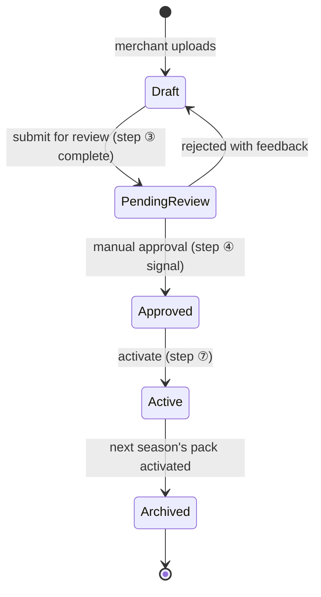

### 4.5 Truth Layer Propagation

When an asset pack is activated, the following downstream effects occur automatically:

1. **Knowledge Base re-embedding**: Product facts referencing updated assets are re-chunked and re-embedded in pgvector.
2. **Brand guideline update**: If the merchant uploads updated brand guidelines alongside assets, they are ingested into the Knowledge Base.
3. **Previous pack archival**: The previously active pack transitions to `archived` state. It remains queryable for historical generation replay but is no longer used in new runs.
4. **Daily generation pickup**: The next daily generation run automatically resolves the newly activated assets from the truth layer — no manual intervention needed.

---

## 5. Weekly Learning DAG

Aggregates performance data, identifies patterns, and feeds insights back into the ranking and generation systems. Powered by the Learning Analyst Agent.

### 5.1 Schedule & Constraints

| Property | Value |
|----------|-------|
| **Schedule** | Weekly on Monday at `05:00 Asia/Shanghai` |
| **Timeout** | 1 hour per merchant |
| **Retry policy** | 2 retries for analytics query failures |
| **Task queue** | `weekly-learning` |
| **Dependencies** | Requires at least 7 days of performance data since last run |

### 5.2 DAG Definition

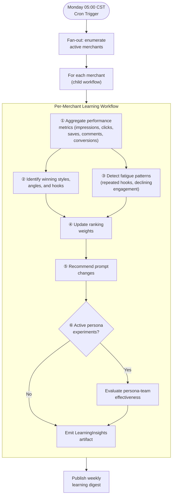

### 5.3 Step Details

| Step | Activity | Agent / Service | Input | Output | Timeout | Retries |
|------|----------|----------------|-------|--------|---------|---------|
| ① | `AggregateMetrics` | Analytics Service | `merchant_id`, 7-day window | Aggregated metrics per note package, product, angle | 5 min | 2 |
| ② | `IdentifyWinners` | Learning Analyst Agent | Aggregated metrics + generation history | Winning styles, hooks, audience segments | 3 min | 2 |
| ③ | `DetectFatigue` | Learning Analyst Agent | Engagement trends, hook/angle frequency | Fatigue alerts per product × dimension | 3 min | 2 |
| ④ | `UpdateRankingWeights` | Ranking Service | Winner signals + fatigue signals | Updated ranking dimension weights | 1 min | 2 |
| ⑤ | `RecommendPromptChanges` | Learning Analyst Agent | Winning patterns + fatigue patterns + current prompt versions | Prompt adjustment recommendations | 2 min | 1 |
| ⑥ | `EvaluatePersonaEffectiveness` | Learning Analyst Agent | Experiment results + performance splits | `persona_experiment_results` within `LearningInsights` | 3 min | 1 |

### 5.4 Learning Feedback Targets

The `LearningInsights` artifact (see `AGENT_TEAM_SPEC.md` § 12.8) feeds into three downstream systems:

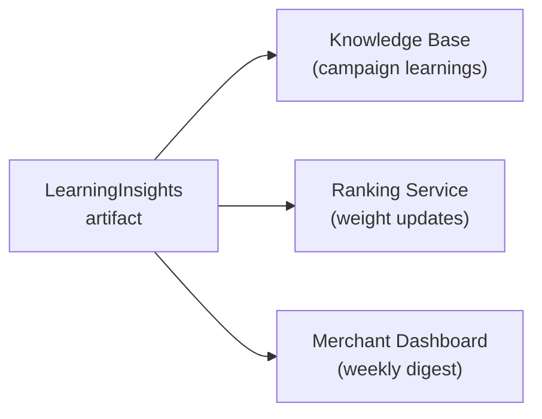

| Target | Data Written | Effect |
|--------|-------------|--------|
| **Knowledge Base** | Campaign learnings, winning templates, fatigue notes | Future RAG retrieval by Strategy Planner and Note Writer |
| **Ranking Service** | Dimension weight adjustments | Next daily generation uses updated ranking formula |
| **Merchant Dashboard** | Human-readable insights, fatigue warnings | Merchant sees performance trends and recommendations |

---

## 6. Persona/Team Experiment DAG

Supports controlled A/B testing of different team compositions or persona assignments on the same product and context. Results feed into the Weekly Learning DAG for statistical analysis.

### 6.1 Schedule & Constraints

| Property | Value |
|----------|-------|
| **Trigger** | Manual via experiment API (`POST /api/v1/experiments`) |
| **Timeout** | 4 hours |
| **Retry policy** | 2 retries for generation failures |
| **Task queue** | `experiment` |
| **Prerequisite** | Experiment record in `persona_experiments` table with status `draft` |

### 6.2 DAG Definition

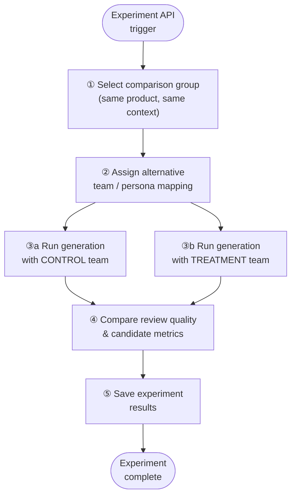

### 6.3 Step Details

| Step | Activity | Service | Timeout | Retries |
|------|----------|---------|---------|---------|
| ① | `SelectComparisonGroup` | Orchestrator | 30s | 1 |
| ② | `AssignTeamVariants` | Team Composition Service + Persona Service | 15s | 1 |
| ③a | `RunControlGeneration` | Full agent pipeline (same as on-demand, control team) | 90 min | 2 |
| ③b | `RunTreatmentGeneration` | Full agent pipeline (same as on-demand, treatment team) | 90 min | 2 |
| ④ | `CompareResults` | Ranking Service + Analytics Service | 5 min | 1 |
| ⑤ | `SaveExperimentResults` | Database (`persona_experiments.result_summary`) | 30s | 2 |

### 6.4 Parallel Generation

Steps ③a and ③b run **in parallel** — the control and treatment pipelines execute concurrently on the same product and context, differing only in team composition. This ensures a fair comparison by eliminating temporal confounds (e.g., API latency drift).

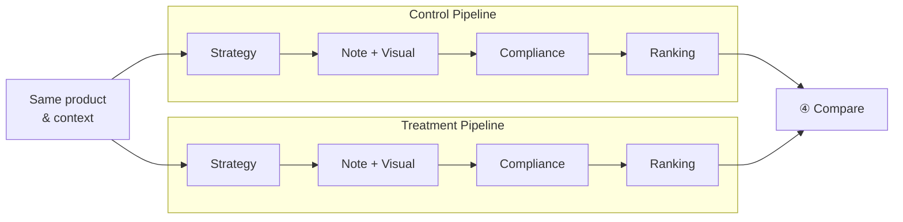

### 6.5 Comparison Dimensions

The comparison step (④) evaluates both pipelines across these dimensions:

| Dimension | Metric | Source |
|-----------|--------|--------|
| **Compliance pass rate** | % of variants passing compliance | `ComplianceReport` |
| **Compliance score** | Average aggregate compliance score | `ComplianceReport` |
| **Ranking score** | Average composite ranking score of top-N | `RankingResult` |
| **Style diversity** | Variance in style/angle across variants | `RankingResult` |
| **Generation latency** | Total pipeline execution time | Temporal activity timing |
| **Retry count** | Number of LLM retries across the pipeline | Activity retry metrics |
| **Cost** | Total token usage and estimated LLM cost | `PipelineExecutionReport` |

Results are persisted to `persona_experiments.result_summary` as structured JSON and are surfaced in the Weekly Learning DAG (§ 5) for longitudinal analysis.

---

## 7. Temporal Workflow Implementation Notes

### 7.1 Mapping: DAGs to Temporal Concepts

| DAG Concept | Temporal Concept | Notes |
|------------|-----------------|-------|
| Workflow | `@workflow.defn` class | One class per DAG type |
| Activity (step) | `@activity.defn` function | Individually retryable units of work |
| Parallel branches | `asyncio.gather()` within workflow | Steps ⑥/⑦ in daily, ③a/③b in experiment |
| Fan-out per merchant | Child Workflow via `workflow.execute_child_workflow()` | Parent collects child results |
| Human approval gate | `workflow.wait_condition()` + `workflow.signal()` | Used in asset refresh and on-demand edit loop |
| Progress tracking | `workflow.query()` handlers | Frontend polls for step completion status |
| Idempotency | Deterministic Workflow IDs (see § 1) | Prevents duplicate runs on scheduler retry |

### 7.2 Task Queue Topology

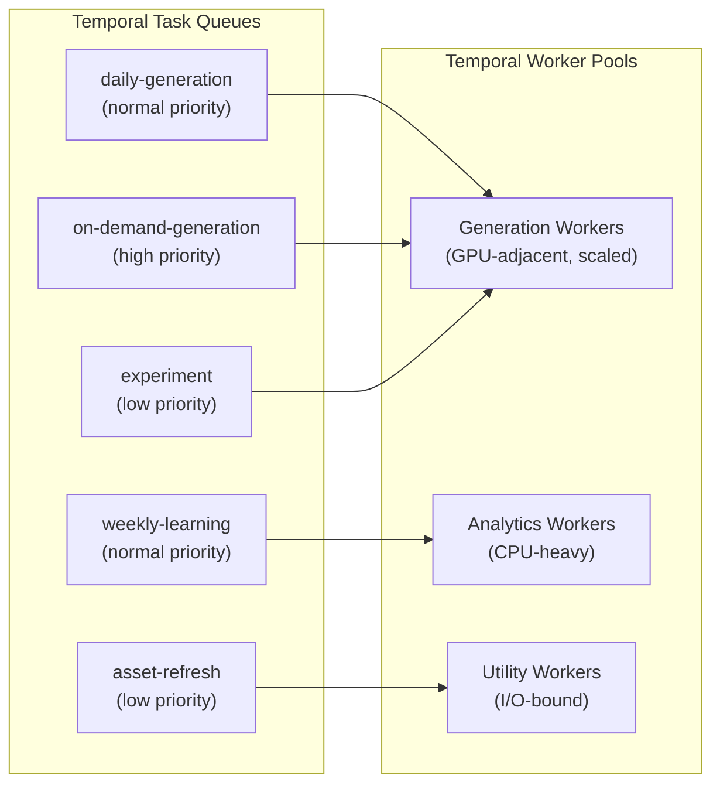

Worker pools are independently scaled via Kubernetes HPA based on Temporal task queue backlog depth.

### 7.3 Activity Retry Policies

All activities use per-activity retry policies. The defaults below can be overridden at the activity level:

```python
DEFAULT_RETRY_POLICY = RetryPolicy(
    initial_interval=timedelta(seconds=10),
    backoff_coefficient=2.0,
    maximum_interval=timedelta(minutes=5),
    maximum_attempts=3,
    non_retryable_error_types=[
        "ComplianceHardReject",
        "SchemaValidationError",
        "TenantNotFoundError",
        "AssetPackNotFoundError",
    ],
)
```

| Activity Category | Initial Interval | Backoff | Max Attempts | Max Interval |
|------------------|------------------|---------|--------------|--------------|
| LLM generation (text) | 5s | 2.0× | 3 | 2 min |
| LLM generation (image) | 10s | 2.0× | 3 | 5 min |
| Compliance checks | 5s | 2.0× | 2 | 1 min |
| Database writes | 2s | 2.0× | 3 | 30s |
| Analytics queries | 10s | 2.0× | 2 | 3 min |
| External API calls | 15s | 3.0× | 3 | 5 min |
| Image processing | 30s | 2.0× | 2 | 5 min |

### 7.4 Temporal Signals

Signals are used for human-in-the-loop interactions:

| Signal Name | Workflow | Payload | Purpose |
|-------------|----------|---------|---------|
| `user_approve` | On-Demand Generation | `{ variant_ids: string[] }` | Merchant approves selected variants |
| `user_edit` | On-Demand Generation | `{ edits: EditRequest[] }` | Merchant requests copy/visual modifications |
| `asset_approved` | Quarterly Asset Refresh | `{ pack_id: string, approved_asset_ids: string[] }` | Reviewer approves asset pack |
| `asset_rejected` | Quarterly Asset Refresh | `{ pack_id: string, feedback: string }` | Reviewer rejects with feedback |
| `cancel_experiment` | Persona/Team Experiment | `{ reason: string }` | Abort running experiment |

### 7.5 Temporal Queries

Queries are used for progress tracking and operational visibility:

| Query Name | Workflow(s) | Returns | Consumer |
|------------|-------------|---------|----------|
| `get_progress` | All | `{ completed_steps: int, total_steps: int, current_step: string, percent: float }` | Frontend progress bar |
| `get_products_status` | Daily Generation | `{ product_id: string, status: string, error?: string }[]` | Operational dashboard |
| `get_pipeline_artifacts` | On-Demand, Daily | `{ step: string, artifact_type: string, artifact_id: string }[]` | Debug / artifact inspector |
| `get_comparison_preview` | Persona Experiment | `{ control: VariantSummary, treatment: VariantSummary }` | Experiment dashboard |

### 7.6 Workflow Versioning

Temporal workflows use **patched** versioning for backward-compatible changes:

```python
if workflow.patched("add-fatigue-scoring-v2"):
    fatigue = await workflow.execute_activity(
        compute_fatigue_scores_v2, ...
    )
else:
    fatigue = await workflow.execute_activity(
        compute_fatigue_scores, ...
    )
```

Breaking changes deploy as new workflow types with a migration period where both old and new types coexist.

---

## 8. Error Handling Strategy

### 8.1 Per-Product Isolation

In batch workflows (Daily Generation, Weekly Learning), each product is processed in an isolated error boundary:

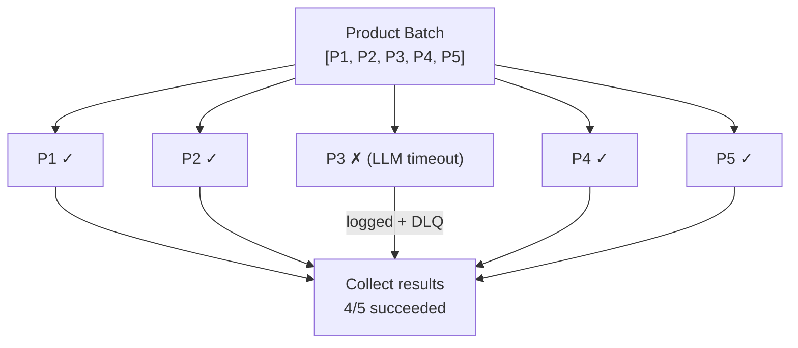

- A failed product is caught, logged with full context, and sent to the **dead letter queue (DLQ)**.
- The batch continues processing remaining products.
- The daily summary reports partial success: `4/5 products succeeded, 1 failed (P3: LLM timeout)`.

### 8.2 Error Classification

| Error Class | Examples | Retryable | Action |
|-------------|----------|-----------|--------|
| **Transient** | LLM API timeout, network error, rate limit 429 | Yes | Automatic retry with exponential backoff |
| **Schema Validation** | LLM output fails Pydantic validation | Yes (up to 3×) | Retry with enhanced prompt specificity |
| **Compliance Hard Reject** | Content contains banned words from regulatory list | No | Skip variant, log finding, continue pipeline |
| **Resource Not Found** | Product deleted mid-run, asset pack missing | No | Skip product, alert merchant |
| **Quota Exceeded** | Merchant exceeded generation quota | No | Fail workflow, notify merchant |
| **Infrastructure** | Database down, Redis unavailable | Yes | Retry with long backoff, alert on-call |

### 8.3 Dead Letter Queue (DLQ)

Failed products and activities that exhaust all retries are sent to a Redis Stream-backed DLQ:

| DLQ Property | Value |
|--------------|-------|
| **Stream name** | `dlq:workflow-failures:{merchant_id}` |
| **Retention** | 7 days |
| **Payload** | `{ workflow_id, activity_name, product_id, error_type, error_message, input_snapshot, timestamp }` |
| **Consumer** | Ops dashboard + alerting rules |

DLQ entries can be manually retried via the admin panel or automatically reprocessed by a nightly DLQ drain workflow.

### 8.4 Alert Thresholds

| Metric | Warning | Critical | Channel |
|--------|---------|----------|---------|
| Workflow failure rate (per merchant, daily) | >10% | >25% | DingTalk |
| Activity retry rate | >20% | >50% | PagerDuty |
| DLQ depth | >10 items | >50 items | PagerDuty |
| Compliance hard-reject rate | >40% | >60% | DingTalk (merchant) |
| Workflow duration exceeds timeout | 80% of limit | 95% of limit | PagerDuty |
| LLM API error rate | >5% | >15% | PagerDuty |

---

## 9. Monitoring and Observability

### 9.1 Temporal Web UI

The Temporal Web UI provides built-in workflow visualization:

- **Workflow list**: Filter by workflow type, status, merchant ID, date range.
- **Workflow detail**: Visual timeline of activities, inputs, outputs, retries, and errors.
- **Search**: Query workflows by custom search attributes (merchant_id, product_id, job_id).

### 9.2 Custom Search Attributes

Registered Temporal search attributes for operational queries:

| Attribute | Type | Indexed On |
|-----------|------|------------|
| `merchant_id` | Keyword | All workflows |
| `product_id` | Keyword | Generation workflows |
| `job_status` | Keyword | Generation workflows |
| `generation_date` | Datetime | Daily generation |
| `experiment_id` | Keyword | Experiment workflows |
| `asset_pack_id` | Keyword | Asset refresh workflows |
| `total_variants` | Int | Generation workflows |
| `compliance_pass_rate` | Double | Generation workflows |

### 9.3 Custom Metrics

All workflows emit OpenTelemetry metrics to the observability stack:

| Metric | Type | Labels | Description |
|--------|------|--------|-------------|
| `genpos.workflow.duration_ms` | Histogram | `workflow_type`, `merchant_id`, `status` | End-to-end workflow execution time |
| `genpos.workflow.success_rate` | Gauge | `workflow_type`, `merchant_id` | Rolling success rate (24h window) |
| `genpos.activity.duration_ms` | Histogram | `activity_name`, `workflow_type` | Per-activity execution time |
| `genpos.activity.retry_count` | Counter | `activity_name`, `error_type` | Retry events per activity |
| `genpos.llm.latency_ms` | Histogram | `model`, `activity_name` | LLM API call latency |
| `genpos.llm.tokens` | Counter | `model`, `direction` (input/output) | Token consumption |
| `genpos.compliance.pass_rate` | Gauge | `merchant_id`, `check_type` | Compliance pass rate by check type |
| `genpos.ranking.score_distribution` | Histogram | `merchant_id` | Distribution of composite ranking scores |
| `genpos.dlq.depth` | Gauge | `merchant_id` | Dead letter queue depth |
| `genpos.generation.variants_produced` | Counter | `merchant_id`, `product_id` | Variants generated |
| `genpos.generation.variants_approved` | Counter | `merchant_id`, `product_id` | Variants passing compliance |

### 9.4 OpenTelemetry Trace Propagation

Every Temporal workflow and activity carries an OpenTelemetry trace context. The trace ID is propagated through:

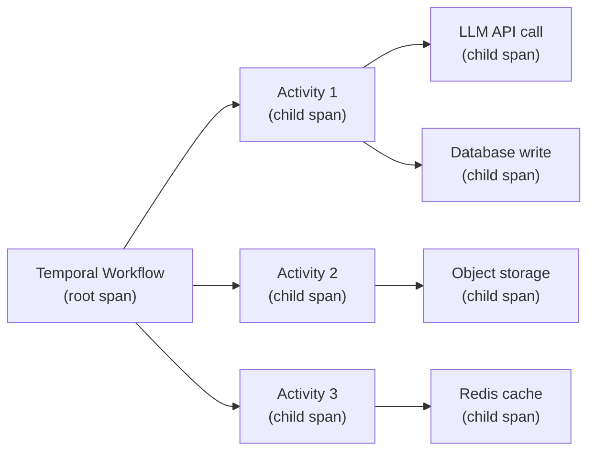

Trace context is injected into:
- Temporal workflow/activity headers (automatic via OpenTelemetry Temporal interceptor)
- HTTP headers for service-to-service calls
- LLM API request metadata (for cost attribution)
- Database query comments (for slow query correlation)

### 9.5 Key Dashboards

| Dashboard | Metrics Displayed | Primary Audience |
|-----------|------------------|------------------|
| **Daily Generation Health** | Throughput, success rate, duration P50/P95/P99, products processed, variants produced, compliance pass rate | Platform ops |
| **On-Demand Latency** | End-to-end latency, per-step latency breakdown, concurrent workflow count, timeout rate | Platform ops |
| **Workflow Queue Depth** | Task queue backlog per queue, worker utilization, scheduling latency | Infrastructure |
| **LLM Cost & Performance** | Token usage by model/activity, cost per generation, latency percentiles, retry rate | Cost management |
| **Compliance Pipeline** | Pass rate by check type, top failure reasons, hard-reject rate, merchant breakdown | Compliance team |
| **Merchant Generation Summary** | Per-merchant daily volume, success rate, average variants, review turnaround time | Customer success |
| **Experiment Results** | Control vs. treatment comparison, statistical significance, cost delta | Product team |
| **DLQ Monitor** | Queue depth over time, failure categories, auto-retry success rate | On-call engineering |

---

## Appendix A: Workflow ↔ Agent Role Mapping

| Workflow | Agent Roles Involved |
|----------|---------------------|
| Daily Generation | `strategy_planner`, `xhs_note_writer`, `cartoon_visual_designer`, `compliance_reviewer`, `ranking_analyst`, `ops_exporter` |
| On-Demand Generation | `founder_copilot`, `strategy_planner`, `xhs_note_writer`, `cartoon_visual_designer`, `compliance_reviewer`, `ranking_analyst`, `ops_exporter` |
| Quarterly Asset Refresh | None (service-level activities only) |
| Weekly Learning | `learning_analyst` |
| Persona/Team Experiment | Same as On-Demand (both control and treatment run the full pipeline) |

## Appendix B: Workflow ↔ Artifact Flow

| Workflow | Artifacts Produced |
|----------|--------------------|
| Daily Generation | `StructuredJobRequest` → `StrategyPlan` → `NoteContentSet` + `VisualAssetSet` → `ComplianceReport` → `RankingResult` → `ExportBundleSet` |
| On-Demand Generation | Same as Daily, plus interactive edit artifacts |
| Quarterly Asset Refresh | Asset state transitions (no typed pipeline artifacts) |
| Weekly Learning | `LearningInsights` |
| Persona/Team Experiment | Two parallel artifact chains (control + treatment) + `ExperimentResult` |

## Appendix C: Related Documents

| Document | Path | Relationship |
|----------|------|-------------|
| Architecture | `docs/architecture/ARCHITECTURE.md` | Parent: § 6.6 Workflow Service, § 7 Data Flow |
| Agent Team Spec | `docs/architecture/AGENT_TEAM_SPEC.md` | Agent roles, pipeline, artifacts |
| ERD | `docs/architecture/ERD.sql` | Database tables: `generation_jobs`, `generation_tasks`, `persona_experiments` |
| API Spec | `docs/api/openapi.yaml` | API endpoints that trigger on-demand and experiment workflows |
| Prompt Contracts | `docs/prompts/PROMPT_CONTRACTS.md` | Prompt templates used by agent activities |
